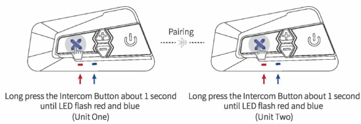
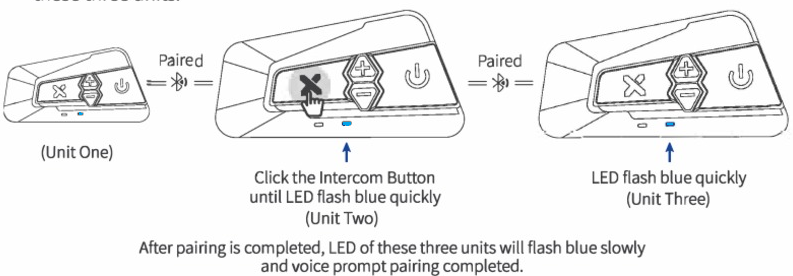

# Сопряжение по Bluetooth

Примечание: 
В режиме групповой внутренней связи к одному устройству LX-B4FM можно одновременно подключать до **двух** устройств LX-B4FM 
и **один** мобильный телефон.
Он может автоматически подключаться к вашему последнему сопряженному устройству, если включен Bluetooth,
или когда устройство не подключено и находится в режиме ожидания, нажмите кнопку питания, чтобы подключиться к устройству Bluetooth.

## Сопряжение телефона
**Шаг 1:** При выключенном питании нажмите и удерживайте кнопку питания (пока светодиод не начнет попеременно мигать синим и красным),
чтобы перейти в режим сопряжения; 

Примечание: Пожалуйста, не используйте кнопку внутренней связи вместо кнопки включения для сопряжения вашего телефона и GPS-устройств.

**Шаг 2.** Перейдите к настройкам Bluetooth на вашем телефоне. Выберите "LX-B4FM", для некоторых мобильных телефонов может потребоваться PIN-код.
При необходимости введите "0000" в качестве PIN-кода; 

**Шаг 3:** Пожалуйста, подтвердите подключение вашего телефона, если сопряжение завершено;

Примечание: На устройстве B4FM индикатор будет мигать синим, что означает, что подключение завершено.

## Сопряжение Bluetooth GPS-навигатора
**Шаг 1**: При выключенном питании продолжительно нажимайте кнопку питания в течение примерно 5 секунд, пока индикатор питания
не начнет попеременно мигать синим и красным, чтобы перейти в режим сопряжения;

# Подключение по Intercom

Bluetooth-гарнитуры B4FM поддерживают 
полнодуплексный режим Intercom по Bluetooth,
групповое сопряжение по внутренней связи, разделенное на режим 4-сторонней внутренней связи и режим многосторонней внутренней связи.
В режиме многосторонней внутренней связи можно подключить до 10 абонентов.

Примечание: 
Перед подключением устройств B4FM для связи и началом поездки мы настоятельно рекомендуем отключить существующие подключения на устройстве.
**Чтобы отключить существующие подключения**, продолжительно нажимайте кнопки `Вверх` и `Вниз` одновременно в течение примерно 1 секунды, пока красный светодиод не начнет быстро мигать, что означает, что все предыдущие подключения к устройству будут отключены.

**Каждый раз, когда вы включаете устройство B4FM, по умолчанию используется режим 4-полосной внутренней связи,
чтобы переключиться в режим многостороннего Intercom, который предназначен для более чем 5 абонентов (включая 5 пассажиров) в режиме ожидания,
вам необходимо долго нажимать кнопку питания в течение примерно 8 секунд на всех устройствах, раздастся звуковой сигнал,
и одновременно индикатор быстро замигает красным. 
Функция запоминания для этой операции отсутствует, поэтому вам придется переключать ее каждый раз при подключении более 5 устройств.**

## Сопряжение и подключение Intercom по Bluetooth

### Шаг 1 (двустороннее сопряжение): 

**Включение:** Включите два устройства B4FM.

**Переход в режим сопряжения:** Нажмите и удерживайте кнопку `X` Intercom на обоих устройствах около 1 секунды. 
Светодиоды обоих устройств будут попеременно мигать красным и синим, что указывает на переход в режим сопряжения.

**Сопряжение:** Нажмите кнопку `X` Intercom на одном из устройств для поиска и сопряжения с другим устройством, светодиод _быстро_ замигает _синим_.
После завершения сопряжения светодиод начнет _медленно_ мигать _синим_ на обоих устройствах.

Примечание: Если вам нужно выполнить сопряжение только с двумя устройствами B4FM,
вам нужно завершить только **Шаг 1** и можно начать разговор по Intercom.

### Начало разговора по Intercom:
После окончания сопряжения нажатие на любом из устройств кнопки `X` Intercom позволяет начать разговор по внутренней связи.
В режиме внутренней связи светодиод будет мигать синим и красным одновременно.

**Временное отключение устройства от Intercom:** Нажмите кнопку `питания` на любом из этих устройств, чтобы временно отключить текущее переговорное устройство;

**Возобновление подключения к Intercom:** Нажмите кнопку `X` Intercom на любом из этих устройств еще раз, чтобы возобновить разговор по Intercom.

### Шаг 2 (трехстороннее сопряжение):

**Переход в режим сопряжения устройств 2 и 3:** После выполнения **Шага 1** и сопряжения устройств **1** и **2**
выплните сопряжение на устройствах **2** и **3**.

Включите питание на устройствах **2** и **3**. 

Нажмите и удерживайте около 1 секунды кнопку `X` Intercom и кнопку `Вниз` на устройствах **2** и **3**.
Светодиоды обоих устройств будут попеременно мигать красным и синим, что означает переход в режим сопряжения.

Нажмите кнопку внутренней связи на любом из устройств для поиска и сопряжения с другим устройством, светодиод быстро замигает синим. После завершения сопряжения светодиод на этих трех устройствах начнет медленно мигать синим.

Примечание:
1. Если вам нужно подключить только три устройства B4FM, вам нужно выполнить **Шаг 2**, а затем начать разговор по Intercom.
2. Если второе устройство отключено, другие устройства также будут отключены.

### Начало разговора по Intercom:
После успешного сопряжения нажмите кнопку `X` Intercom на любом из этих устройств, чтобы начать разговор по Intercom.
В режиме внутренней связи светодиод будет мигать синим и красным одновременно.

**Временное отключение устройства от Intercom:**
Нажмите кнопку питания на любом из этих устройств, чтобы временно отключить текущее переговорное устройство;

**Возобновление подключения к Intercom:** Нажмите кнопку `X` Intercom на любом из этих устройств еще раз, чтобы возобновить разговор по Intercom.

### Шаг 3 Четырехстороннее сопряжение:

**Переход в режим сопряжения устройств 3 и 4:**
После выполнения **Шагов 1 и 2** и сопряжения устройств **1**, **2** и **3** выполните сопряжение устройств **3** и **4**.
Для этого на устройствах **3** и **4** в режиме ожидания нажмите и удерживайте кнопку `X` Intercom около одной секунды,
голос произнесёт "Pairing", затем светодиоды на обоих устройствах будут попеременно мигать красным и синим,
что указывает на переход в режим сопряжения.

**Сопряжение:**
Нажмите кнопку `X` Intercom на любом из устройств для поиска и сопряжения с другим устройством, светодиод быстро замигает синим.
После завершения сопряжения светодиод на этих четырех устройствах начнет медленно мигать синим.

### Начало разговора по Intercom:
После успешного сопряжения нажмите кнопку `X` Intercom на любом из этих устройств, чтобы начать разговор по Intercom.
В режиме внутренней связи светодиод будет мигать синим и красным одновременно.

**Временное отключение устройства от Intercom:**
Нажмите кнопку питания на любом из этих устройств, чтобы временно отключить текущее переговорное устройство;

**Возобновление подключения к Intercom:**
Нажмите кнопку `X` Intercom на любом из этих устройств еще раз, чтобы возобновить разговор по Intercom.

Примечание:
При отключении одного из устройств группа внутренней связи будет разделена на две отдельные группы.
Нажмите кнопку `X` Intercom еще раз, чтобы восстановить подключение Intercom, две независимые группы внутренней связи будут подключены повторно.