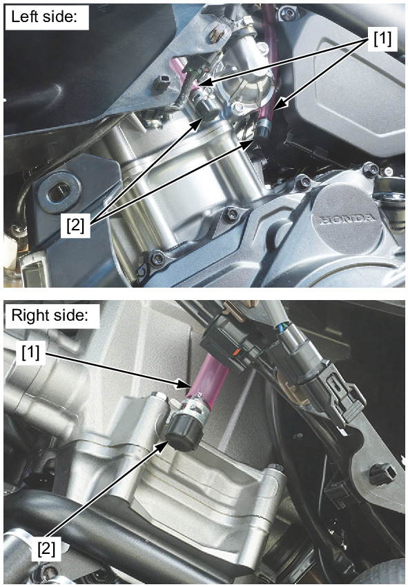

# Air Box Crankcase Breathers

Источник: `Air Box Crankcase Breathers.pdf`

## CRANKCASE BREATHER 
Check the air cleaner 
housing drain hoses [1]. 

NOTE: 
* Service if the 
deposits level can be 
seen in the drain 
hose. 

If necessary, remove the 
drain plugs [2] from the 
drain hoses and drain the 
deposits into a suitable 
container. 

Reinstall the plugs 
securely. 

