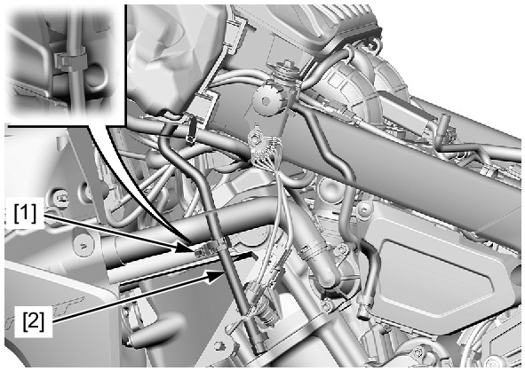
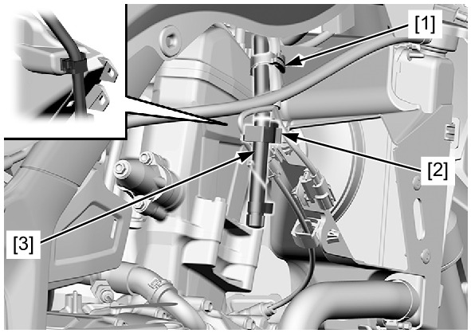
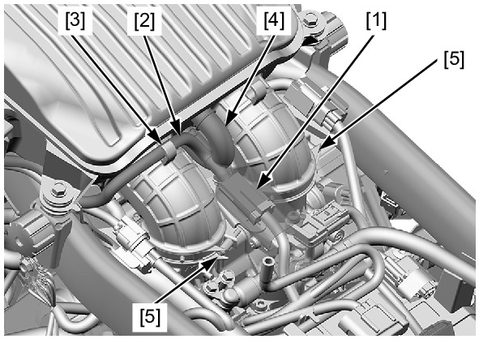
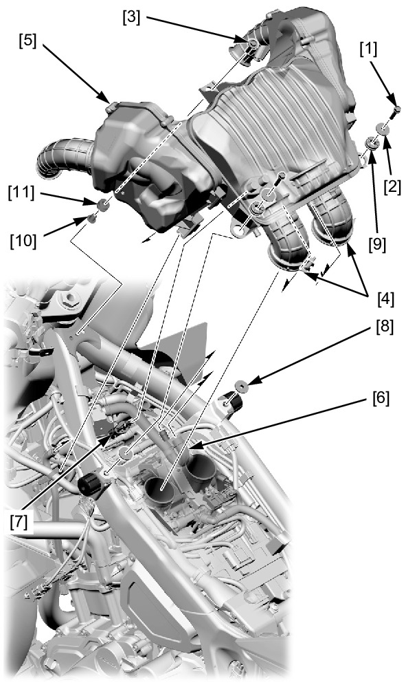
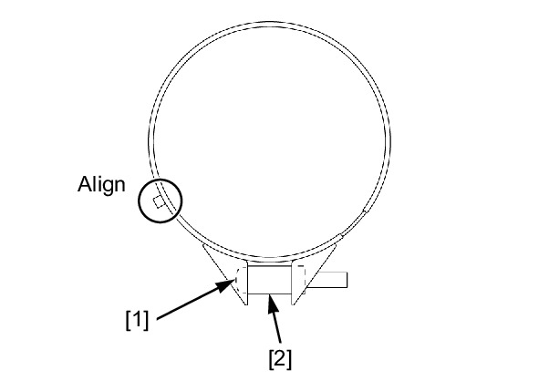

# Air Box

Источник: `Air Box.pdf`

REMOVAL/INSTALLATION 
Remove the following: 
* Inner cover 
* Fuel tank 
Open the clamp [1] and release the air cleaner housing drain hose [2]. 
Open the clamp A [1]. 
Open the clamp B [2]. 
Release the air cleaner housing drain hose [3]. 

Release the ignition switch 2P (Brown) connector [1] from the stay. 
Release the ignition switch wire [2] from the guide [3]. 
Disconnect the air suction hose [4]. 
Loosen the connecting hose band screws [5]. 
Remove the following: 
* Bolts [1] 
* Collars A [2] 
* Bolt/washer [3] 
Disconnect the air cleaner housing connecting hoses [4]. 
Pull the air cleaner housing [5] upward. 
Disconnect the air suction hose [6] from the cylinder head cover. 
Disconnect the IAT sensor 2P (Blue) connector [7]. 
Remove the air cleaner housing. 
Remove the collars B [8]. 
Remove the following from the air cleaner housing: 
* Grommets A [9] 
* Collar C [10] 
* Grommet B [11] 

Installation is in the reverse order of removal. 

NOTE: 
* Route the wires and hoses properly . 
* Align the hose band holes with the connecting hose bosses. 
* Tighten the connecting hose band screws [1] until the collars [2] are fully seated. 

