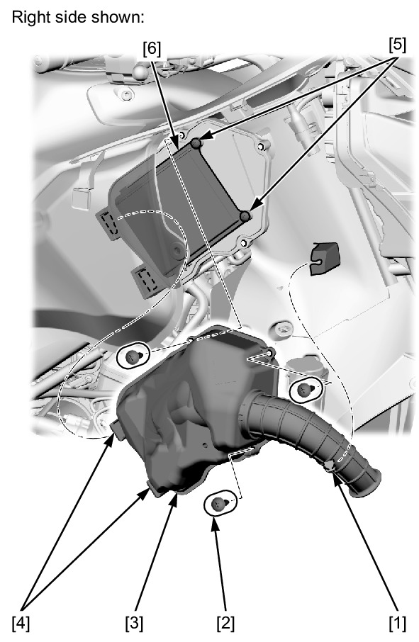

# Air Filter

Источник: `Air Filter.pdf`

AIR CLEANER 

NOTE: 
* The viscous paper element type air cleaner can not be cleaned because the element contains a dust adhesive. 
* If the motorcycle is used in unusually wet or dusty areas, more frequent inspections are required. 
Remove the middle cowl . 
Release the tab [1] of the air duct from the inner cover. 
Remove the screws [2]. 
Remove the air cleaner lid [3] from the air cleaner housing by pulling it forward to release the tabs [4]. 
Remove the air cleaner element mounting screws [5] and air cleaner element [6]. 
Replace the air cleaner element in accordance with the MAINTENANCE SCHEDULE . 
Also replace the air cleaner element any time if it is excessively dirty or damaged. 
Install the removed parts in the reverse order of removal. 
TORQUE: 
Air cleaner element mounting screw: 
1.1 N·m (0.11 kgf·m, 0.8 lbf·ft) 
Air cleaner cover screw: 
1.1 N·m (0.11 kgf·m, 0.8 lbf·ft) 

