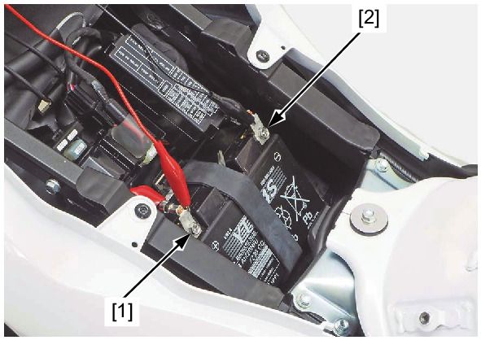

# Battery - Charging Voltage

Источник: `Battery - Charging Voltage.pdf`

CHARGING VOLTAGE INSPECTION 

NOTE: 
* Make sure the battery is in good condition before performing this test. 
Start the engine and warm it up to the operating 
temperature; then stop the engine. 
Remove the main seat . 
Connect the multimeter between the battery positive (+) 
terminal [1] and negative (–) terminal [2]. 

NOTE: 
* To prevent a short, make absolutely certain which 
are the positive and negative terminals or cable. 
* Do not disconnect the battery or any cable in the 
charging system without first switching off the 
ignition switch. Failure to follow this precaution can 
damage the tester or electrical components. 
With the headlight on high beam, restart the engine. 
Measure the voltage on the multimeter when the engine 
runs at 5,000 r/min. 
STANDARD: 
Measured BV < Measured CV < 15.5 V 
* BV = Battery Voltage 
* CV = Charging Voltage 
If the charging voltage reading is out of the specification, 
inspect the regulator/rectifier . 

