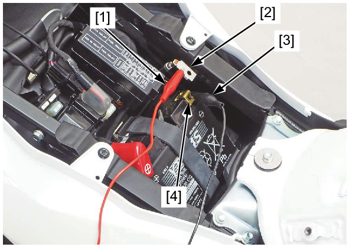

# Battery - Current Leakage Test

Источник: `Battery - Current Leakage Test.pdf`

CURRENT LEAKAGE TEST 
Turn the ignition switch OFF. 
Disconnect the battery negative (–) cable . 
Connect the ammeter (+) probe [1] to the battery 
negative (–) cable [2] and the ammeter (–) probe 
[3] to the battery (–) terminal [4]. 
With the ignition switch OFF, check for current 
leakage. 

NOTE: 
* When measuring current using a tester, set it 
to a high range, and then bring the range 
down to an appropriate level. Current flow 
higher than the range selected may blow the 
fuse in the tester. 
* While measuring current, do not turn the 
ignition switch ON. A sudden surge of current 
may blow the fuse in the tester. 
SPECIFIED CURRENT LEAKAGE: 
0.88 mA max. 
If current leakage exceeds the specified value, a 
shorted circuit is the probable cause. 
Locate the short by disconnecting connections one 
by one and measuring the current. 

