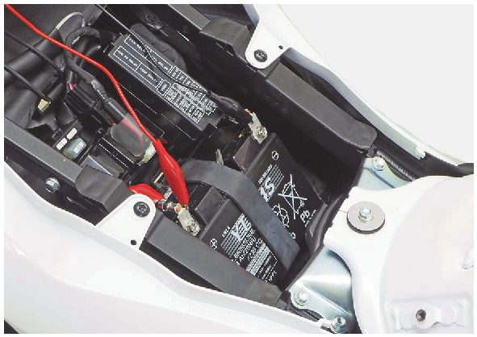

# Battery - Voltage

Источник: `Battery - Voltage.pdf`

VOLTAGE INSPECTION 
Remove the main seat . 
Measure the battery voltage using a commercially 
available digital multimeter. 
VOLTAGE (20°C/68°F): 
Fully charged: 12.8 V 
Needs 
charging: 
Below 12.4 V 

