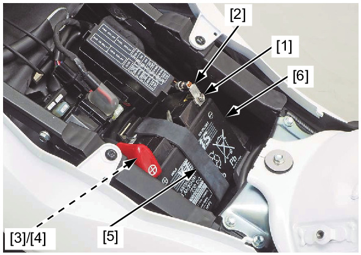

# Battery

Источник: `Battery.pdf`

BATTERY REMOVAL/INSTALLATION 
Remove the main seat . 
Turn the ignition switch OFF. 
Remove the bolt [1] and disconnect the battery 
negative (–) cable [2] first. 
Then remove the bolt [3] and disconnect the 
battery positive (+) cable [4]. 
Release the band [5]. 
Remove the battery [6]. 
Install the battery in the reverse order of removal. 

NOTE: 
* Connect the battery positive (+) cable first 
and then the negative (–) cable. 

