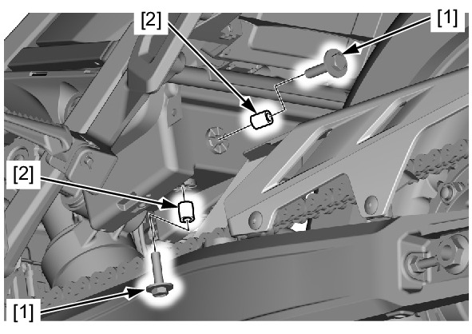
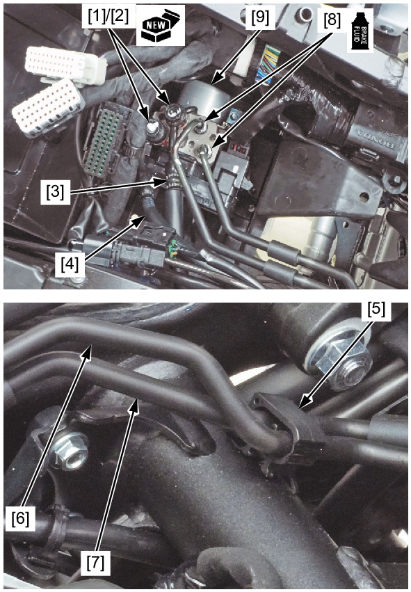

# Brakes - ABS Modulator

Источник: `Brakes - ABS Modulator.pdf`

REMOVAL/INSTALLATION 
Drain the brake fluid from the brake hydraulic system . 
Remove the following: 
* Regulator/rectifier 
* BCU tray 
Disconnect the ABS modulator 18P (Black) connector . 
Remove the following: 
* Bolt/washers [1] 
* Collars [2] 
Remove the following: 
* Oil bolts [1] 
* Sealing washers [2] 
* Rear brake hose A [3] 
* Rear brake hose B [4] 
Open the clamp [5]. 
Release the front brake pipe B [6] and front brake pipe C [7]. 
Loosen the brake pipe joint nuts [8]. 

Remove the front brake pipes from the ABS modulator [9]. 
Remove the ABS modulator. 
Installation is in the reverse order of removal. 
TORQUE: 
Oil bolt: 
34 N·m (3.5 kgf·m, 25 lbf·ft) 
Brake pipe joint nut: 
14 N·m (1.4 kgf·m, 10 lbf·ft) 

NOTE: 
* Apply brake fluid to the joint nut threads. 
* Replace the sealing washers with new ones. 
Fill and bleed the rear brake hydraulic system . 

