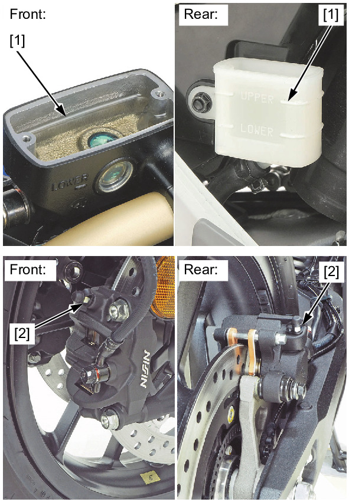
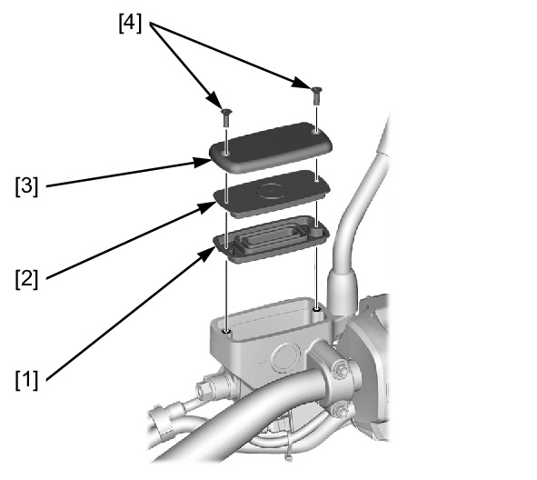
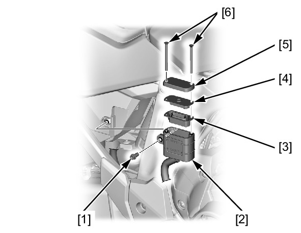

# Brakes - Bleeding

Источник: `Brakes - Bleeding.pdf`

BRAKE FLUID FILLING/AIR BLEEDING 
Fill the reservoir with DOT 4 brake fluid to the upper level line [1] from a sealed container. 
Connect a commercially available brake bleeder to the bleed valve [2]. 
Operate the brake bleeder and loosen the bleed valve. 
If an automatic refill system is not used, add fluid when the fluid level in the reservoir is low. 

NOTE: 
* Check the fluid level often while bleeding the brake to prevent air from being pumped into the system. 
* When using a brake bleeding tool, follow the manufacturer’s operating instructions. 
Perform the bleeding procedure until the system is completely flushed/bled. 

NOTE: 
* If air enters the bleeder from around the bleed valve threads, seal the threads with teflon tape. 
Close the bleed valve and operate the brake lever/pedal. If it still feels spongy, bleed the system again. 
After bleeding the system completely, tighten the bleed valve to the specified torque. 
TORQUE: 5.4 N·m (0.55 kgf·m, 4.0 lbf·ft) 
Fill the reservoir with DOT 4 brake fluid to the upper level line from a sealed container. 
If the brake bleeder is not available, perform the following procedure. 

Fill the reservoir with DOT 4 brake fluid to the upper level line [1] from a sealed container. 
Connect a bleed hose to the bleed valve [2]. 
Pump up the system pressure with the brake lever/pedal until the lever/pedal resistance is felt. 
1. Squeeze the brake lever/pedal all the way and loosen the bleed valve 1/4 turn. Wait several seconds 
and then close the bleed valve. 

NOTE: 
* Do not release the brake lever/pedal until the bleed valve has been closed. 
2. Release the brake lever/pedal slowly and wait several seconds after it reaches the end of its travel. 
3. Repeat the steps 1 and 2 until there are no air bubbles in the bleed hose. 
After bleeding the system completely, tighten the bleed valve to the specified torque. 
TORQUE: 5.4 N·m (0.55 kgf·m, 4.0 lbf·ft) 
Fill the reservoir with DOT 4 brake fluid to the upper level line from a sealed container. 
Install the following: 
! Front brake: 
* Diaphragm [1] 
* Set plate [2] 
* Reservoir cap [3] 

* Front master cylinder reservoir cap screws [4] 
Tighten the front master cylinder reservoir cap screws to the specified torque. 
TORQUE: 1.5 N·m (0.15 kgf·m, 1.1 lbf·ft) 
Remove the rear master cylinder reservoir mounting bolt [1] and rear master cylinder reservoir [2]. 
! Rear brake: 
Install the following: 
* Diaphragm [3] 
* Set plate [4] 
* Reservoir cap [5] 
* Rear master cylinder reservoir cap screws [6] 
Tighten the rear master cylinder reservoir cap screws to the specified torque. 
TORQUE: 1.5 N·m (0.15 kgf·m, 1.1 lbf·ft) 
Install the rear master cylinder reservoir and rear master cylinder reservoir mounting bolt. 
Tighten the rear master cylinder reservoir mounting bolt to the specified torque. 
TORQUE: 10 N·m (1.0 kgf·m, 7 lbf·ft) 

