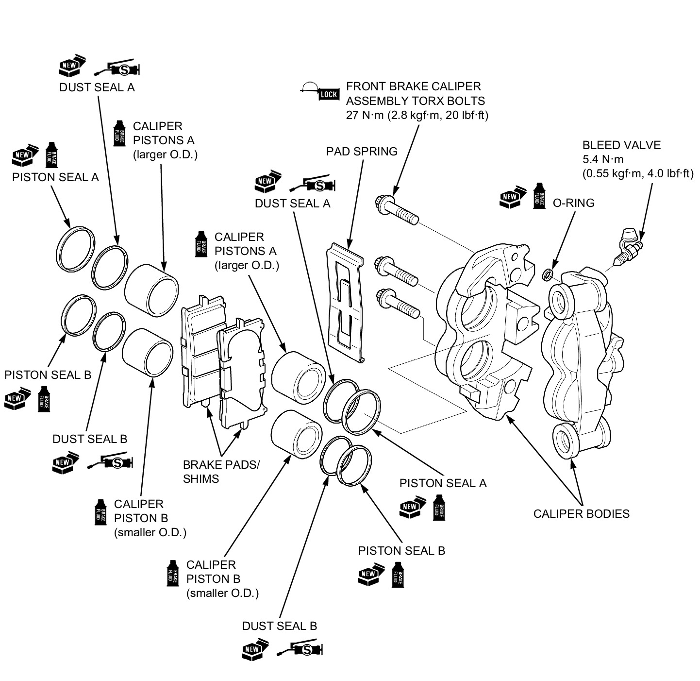

# Brakes - Front Assembly

Источник: `Brakes - Front Assembly.pdf`

DISASSEMBLY/ASSEMBLY 

NOTE: 
* Be careful not to damage each piston. 
* When removing the caliper pistons with compressed air, place a shop towel over the piston to prevent damaging the piston and caliper body. Do not use high pressure or bring the nozzle too close to the fluid inlet. 
* Mark the pistons to ensure correct reassembly. 
* Be careful not to damage the piston sliding surface. 
* Install each caliper piston in their proper locations. 
◦Piston A: larger O.D. 
◦Piston B: smaller O.D. 

