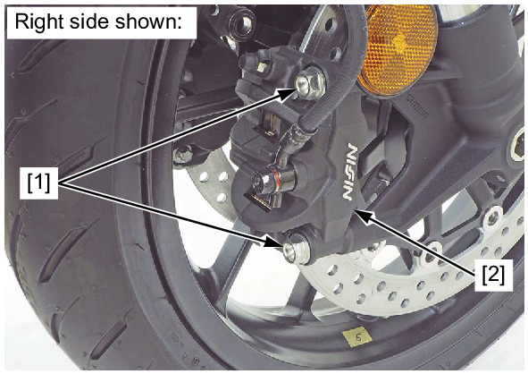
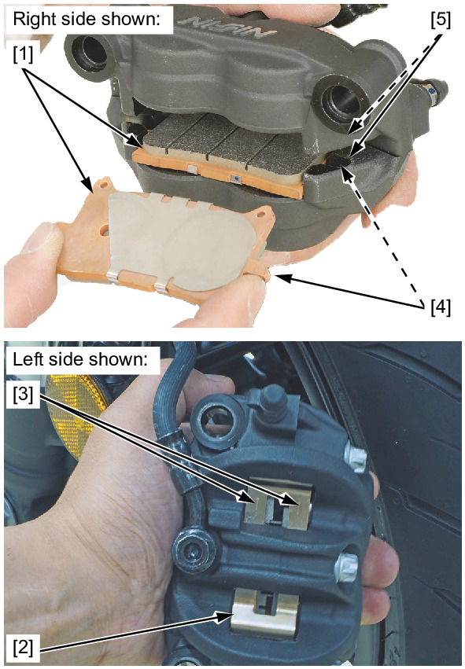
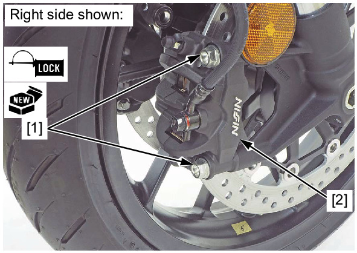

# Brakes - Front Pads

Источник: `Brakes - Front Pads.pdf`

FRONT BRAKE PAD REPLACEMENT 
Remove the front brake caliper mounting bolts [1] and front brake calipers [2]. 

NOTE: 
* Do not operate the brake lever after removing the front brake calipers. 
Remove the brake pads [1]. 
Check the pad spring [2] and replace if necessary. 

NOTE: 
* Install the pad spring with its arrow marks [3] facing up. 
Install new brake pads. 

NOTE: 
* Align the pad lugs [4] with the caliper grooves [5]. 
* Make sure that the brake pads seat against the pad spring. 

Apply locking agent to the front brake caliper mounting bolt [1] threads. 
Install the front brake calipers [2] and new front brake caliper mounting bolts. 
Tighten the front brake caliper mounting bolts to the specified torque. 
TORQUE: 45 N·m (4.6 kgf·m, 33 lbf·ft) 
Operate the brake lever to seat the caliper pistons against the pads. 

