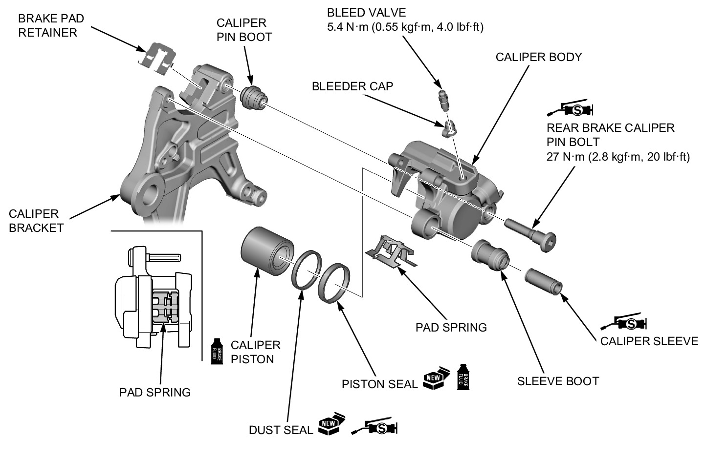

# Brakes - Rear Assembly

Источник: `Brakes - Rear Assembly.pdf`

DISASSEMBLY/ASSEMBLY 

NOTE: 
* Be careful not to damage the piston. 
* When removing the caliper piston with compressed air, place a shop towel over the piston to prevent damaging the piston and caliper body. Do not use high pressure or bring the nozzle too close to the fluid inlet. 
* Be careful not to damage the piston sliding surface. 
* Apply 0.4 g (0.01 oz) of silicone grease to the following: 
◦Sleeve sliding area 
◦Rear brake caliper pin bolt sliding surface 
* If the pad retainer is removed, apply ThreeBond 1521 or an equivalent to the retainer seating surface. 

