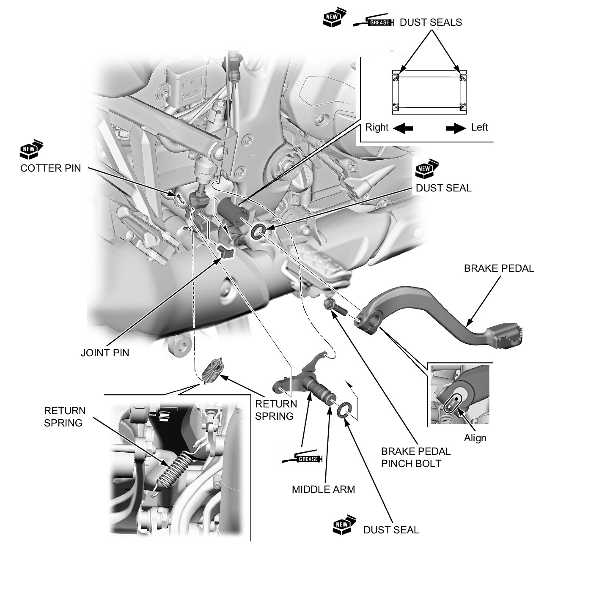

# Brakes - Rear Brake Pedal

Источник: `Brakes - Rear Brake Pedal.pdf`

REMOVAL/INSTALLATION 
Remove the right heel guard . 

NOTE: 
* Align the brake pedal slit with the middle arm punch mark. 
* Apply grease to the dust seal lips. 
* Apply grease to the middle arm pivot sliding surface. 

