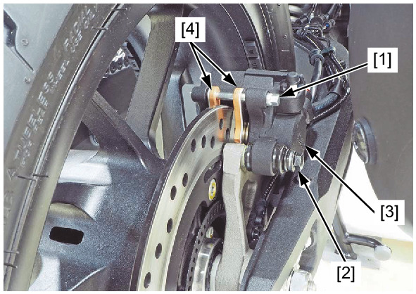
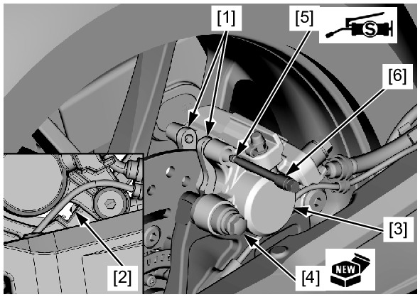
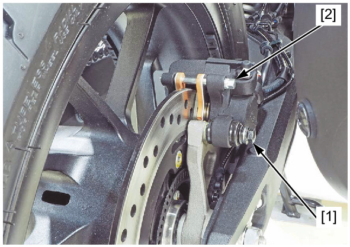
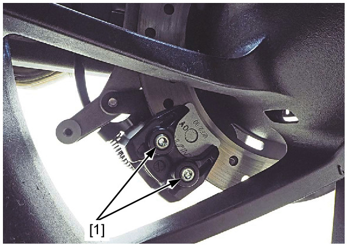
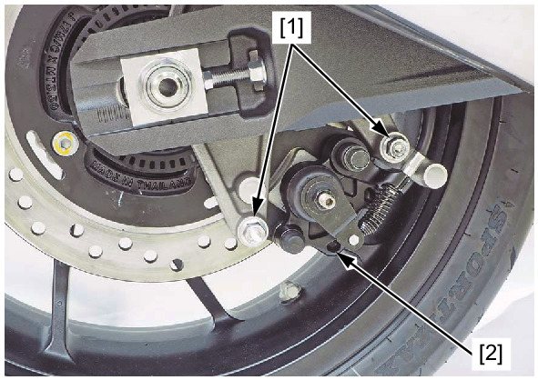
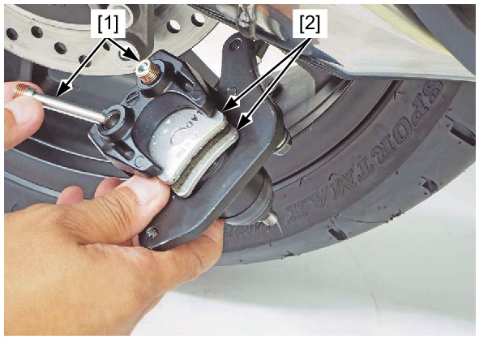
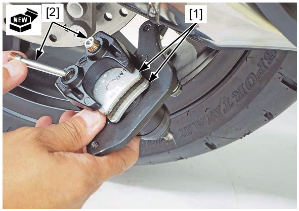
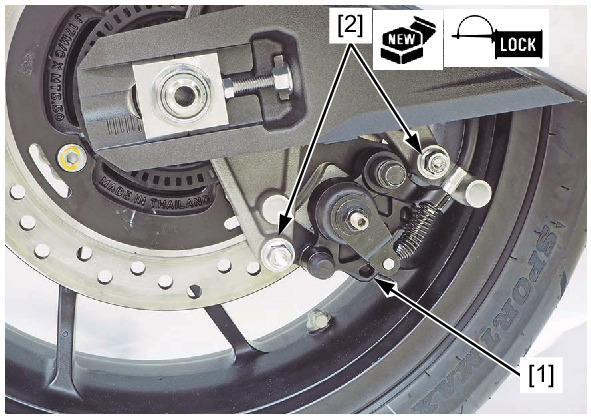
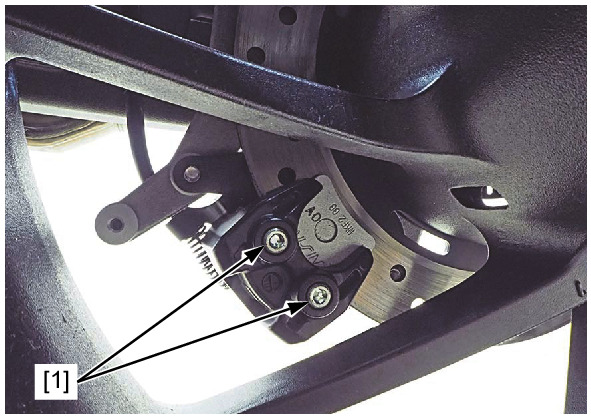

# Brakes - Rear Pads

Источник: `Brakes - Rear Pads.pdf`

REAR BRAKE PAD REPLACEMENT 
Remove the brake pad pin [1] and rear brake caliper mounting bolt [2]. 
Lift the rear brake caliper [3]. 
Remove the brake pads [4]. 

NOTE: 
* Do not operate the brake pedal after removing the brake pads. 
Install new brake pads [1]. 

NOTE: 
* Make sure that the brake pad retainer [2] and pad spring are installed to the rear brake caliper. 
* Make sure that the brake pad ends seat against the retainer. 
Lower the rear brake caliper [3]. 
Loosely install a new rear brake caliper mounting bolt [4]. 
Check that the brake pad pin stopper ring [5] is in good condition, and replace it if necessary. 
Apply silicone grease to the brake pad pin stopper ring. 
Install the brake pad pin [6] by pushing the brake pads. 

NOTE: 
* Align the brake pad pin holes of the brake pads and caliper body. 

Tighten the rear brake caliper mounting bolt [1] to the specified torque. 
TORQUE: 22 N·m (2.2 kgf·m, 16 lbf·ft) 
Tighten the brake pad pin [2] to the specified torque. 
TORQUE: 17 N·m (1.7 kgf·m, 13 lbf·ft) 
Operate the brake pedal to seat the caliper piston against the pads. 
Loosen the parking brake pad pins [1]. 

Remove the parking brake caliper mounting bolts [1] and parking brake caliper [2]. 
Remove the parking brake pad pins [1] and parking brake pads [2]. 
INSTALLATION 

Install new parking brake pads [1]. 

NOTE: 
* Make sure the pad spring is installed in position. 
Install new parking brake pad pins [2]. 
Apply locking agent to the parking brake caliper mounting bolt [1] threads. 
Install the parking brake caliper [2] and new parking brake caliper mounting bolts. 
Tighten the parking brake caliper mounting bolts to the specified torque. 
TORQUE: 30 N·m (3.1 kgf·m, 22 lbf·ft) 

Tighten the parking brake pad pins [1] to the specified torque. 
TORQUE: 17.2 N·m (1.8 kgf·m, 13 lbf·ft) 

