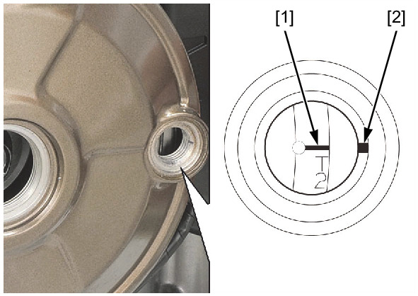
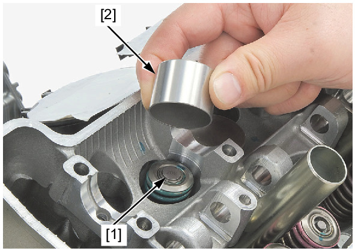
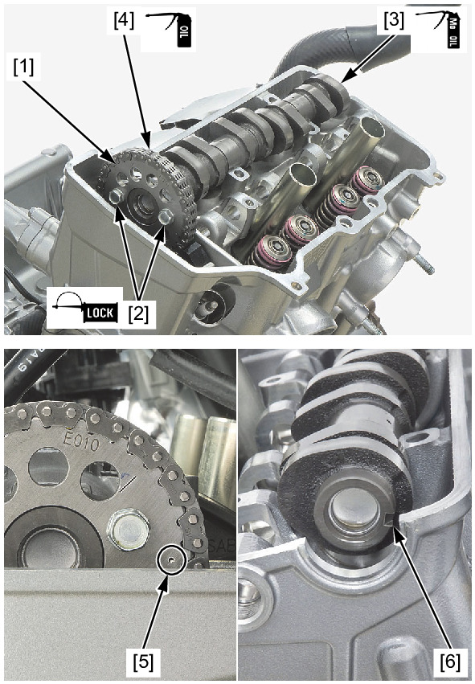
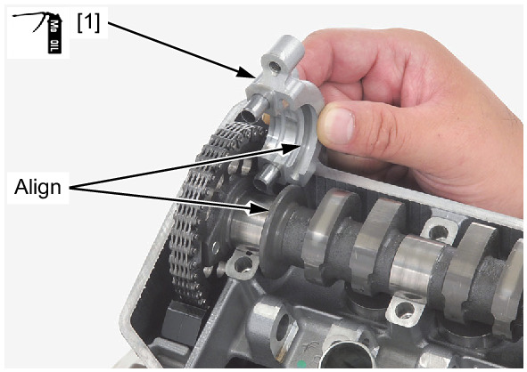
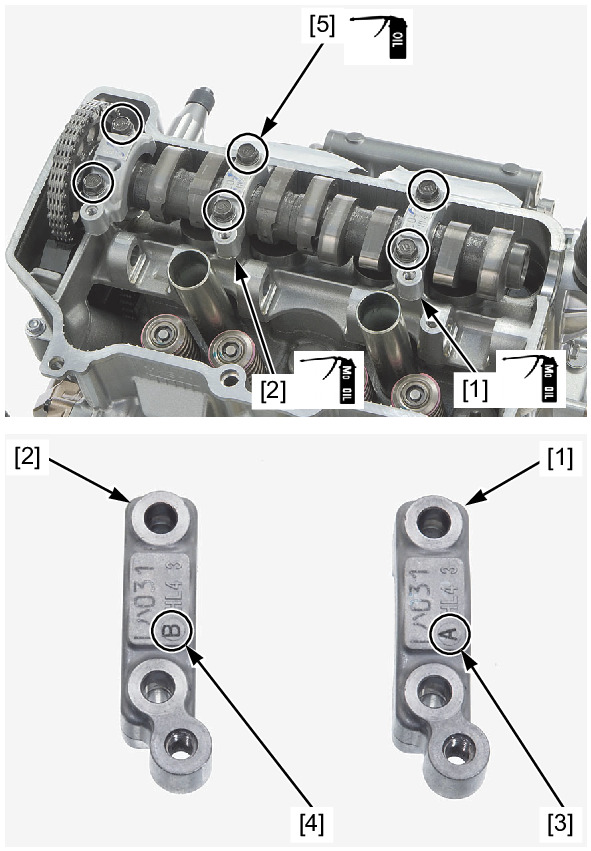
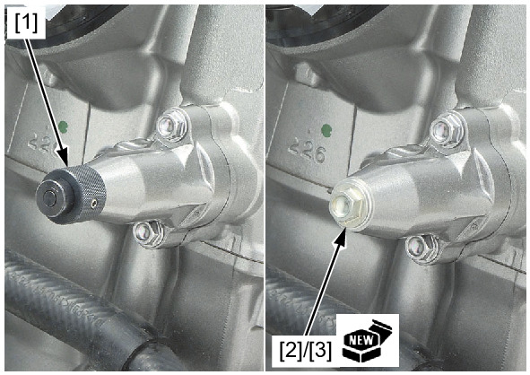
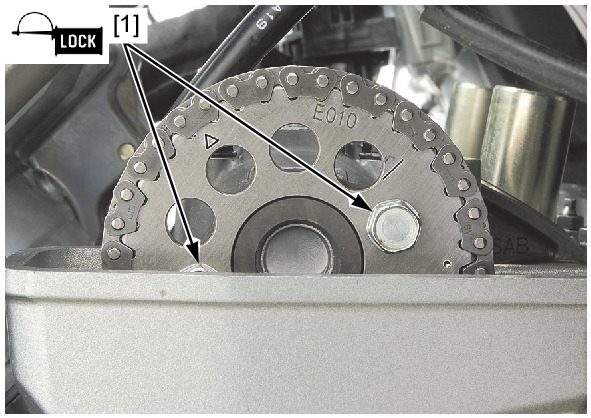

# Camshaft - Install

Источник: `Camshaft - Install.pdf`

INSTALLATION 
Turn the crankshaft counterclockwise and align the "T2" mark [1] on the flywheel with the index mark [2] of the alternator cover. 

NOTE: 
* Be careful not to jam the cam chain and timing sprocket of the crankshaft when rotating the crankshaft. 
Install the shims [1] and valve lifters [2]. 

NOTE: 
* Do not allow the shims to fall into the crankcase. 
* Install all valve lifters and shims in their original locations. 
If the cam sprockets bolts are removed, apply locking agent to the cam sprocket bolts threads. 
Loosely install the cam sprocket [1] and cam sprocket bolts [2] to the camshaft [3]. 
Apply molybdenum oil solution to the camshaft journal, cam lobes, and thrust surfaces. 

Apply engine oil to the cam chain whole surface. 
Install the cam chain [4] over the cam sprocket. 
Set the camshaft onto the cylinder head. 

NOTE: 
* Make sure that the punch mark [5] on the cam sprocket aligns with the upper surface of the cylinder head as shown. 
* Make sure that the camshaft end groove [6] is in position as shown. 
Apply molybdenum oil solution to the camshaft holder B inside. 
Install the camshaft holder B [1]. 

NOTE: 
* Align the groove of the camshaft holder B with the guide of the camshaft. 

Apply molybdenum oil solution to the left camshaft holder A and right camshaft holder A insides. 
Install the left camshaft holder A [1] and right camshaft holder A [2]. 

NOTE: 
* The left camshaft holder A and right camshaft holder A have the following identification marks: 
◦"A" mark [3]: left camshaft holder A 
◦"B" mark [4]: right camshaft holder A 
Apply engine oil to the camshaft holder bolts threads and seating surfaces. 
Install and tighten the camshaft holder bolts [5] to the specified torque. 
TORQUE: 12 N·m (1.2 kgf·m, 9 lbf·ft) 

NOTE: 
* Tighten the camshaft holder bolts in a crisscross pattern in 2 or 3 steps. 

Remove the special tool [1]. 
Install the cam chain tensioner lifter plug [2] and a new sealing washer [3]. 
Tighten the plug securely. 
If the cam sprocket bolts are removed, tighten the cam sprocket bolts [1] to the specified torque. 
TORQUE: 20 N·m (2.0 kgf·m, 15 lbf·ft) 
Install the rocker arms . 

