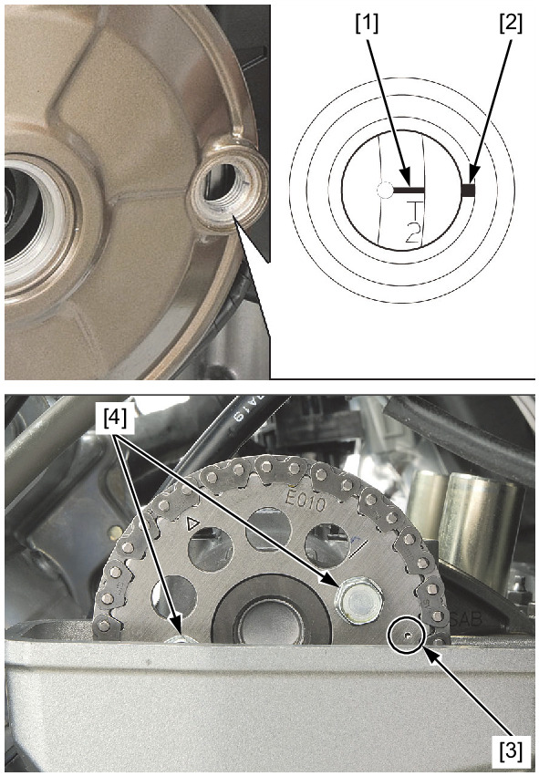
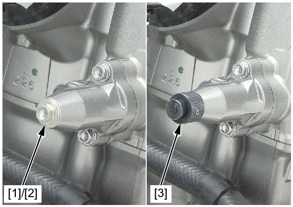
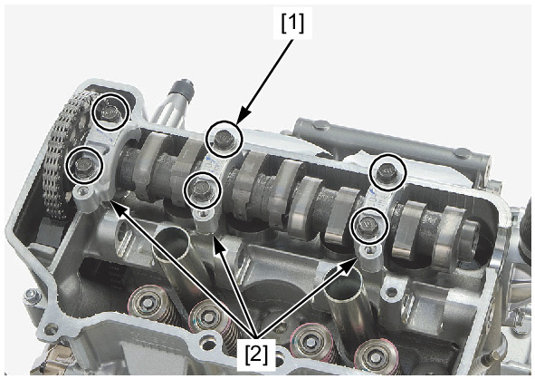
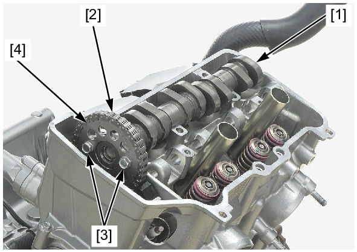
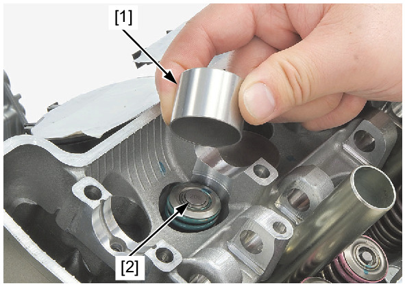

# Camshaft - Removal

Источник: `Camshaft - Removal.pdf`

REMOVAL 
Remove the rocker arms . 
Turn the crankshaft counterclockwise and align the "T2" mark [1] on the flywheel with the index mark [2] of the 
alternator cover. 
Make sure that the punch mark [3] on the cam sprocket aligns with the upper surface of the cylinder head as shown. 
If you plan to disassemble the camshaft and cam sprocket, loosen the cam sprocket bolts [4] at this point. 

NOTE: 
* Do not remove the cam sprocket bolts yet. 

Remove the cam chain tensioner lifter plug [1] and sealing washer [2]. 
Release the cam chain tension by turning the cam chain tensioner lifter shaft fully in (clockwise) and secure it using the 
special tool. 
TOOL: 
Stopper tensioner [3] 
070MG-0010100 
Loosen the camshaft holder bolts [1]. 

NOTE: 
* Loosen the camshaft holder bolts in a crisscross pattern in 2 or 3 steps. 
Remove the camshaft holder bolts and camshaft holders [2]. 

NOTE: 
* Be careful not to let the camshaft holder bolts fall into the crankcase. 
* Do not forcibly remove the dowel pins from the camshaft holders. 

Remove the camshaft [1] by releasing the cam chain [2]. 

NOTE: 
* Attach a piece of wire to the cam chain to prevent it from falling into the crankcase. 
Remove the cam sprocket bolts [3] and cam sprocket [4] from the camshaft if necessary. 
Remove the valve lifters [1] and shims [2]. 

NOTE: 
* Do not allow the shims to fall into the crankcase. 
* Mark all valve lifters and shims to ensure correct reassembly in their original locations. 
* The shims can be easily removed with tweezers or a magnet. 

