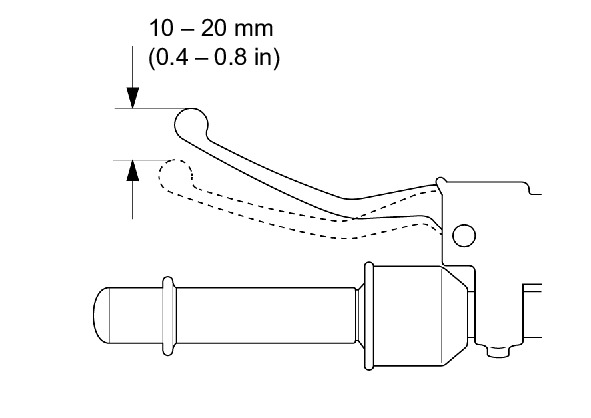
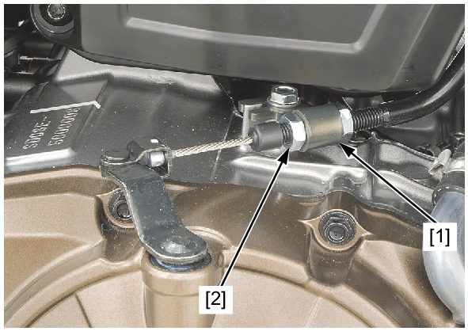

# Clutch System

Источник: `Clutch System.pdf`

Screen History CLUTCH SYSTEM (MT model)

S2MLF000A030026


CLUTCH SYSTEM (MT model) 
Measure the clutch lever freeplay at the end of the 
clutch lever. 
FREEPLAY: 10 – 20 mm (0.4 – 0.8 in) 
Major adjustment is made with the lower adjusting 
nut [1] at the clutch lifter arm. 
Loosen the lock nut [2] and turn the adjusting nut to
Page 1 of 1
30/07/2023
