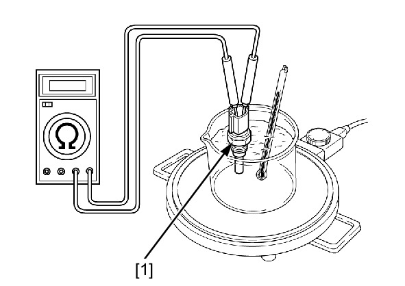

# Coolant - ECT Inspection

Источник: `Coolant - ECT Inspection.pdf`

INSPECTION 
Remove the ECT sensor . 
Suspend the ECT sensor [1] in a pan of coolant on 
an electric heating element and measure the 
resistance through the sensor as the coolant heats 
up. 
* Soak the ECT sensor in coolant up to its 
threads with at least 40 mm (1.6 in) from the 
bottom of the pan to the bottom of the sensor. 
* Keep the temperature constant for 3 minutes 
before testing. A sudden change of 
temperature will result in incorrect readings. 
Do not let the thermometer or ECT sensor 
touch the pan. 
Measure the resistance between the ECT sensor 
terminals. 
Temperature 
40°C (104°F) 
100°C (212°F) 
Resistance 
1.0 – 1.3 kΩ 
0.14 – 0.17 kΩ 
Replace the ECT sensor if it is out of specification. 

