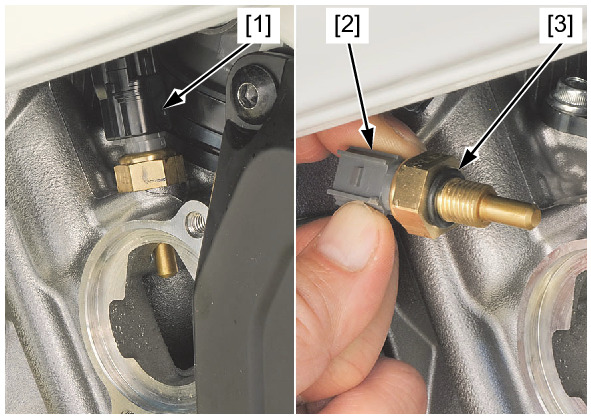

# Coolant - ECT Sensor

Источник: `Coolant - ECT Sensor.pdf`

REMOVAL/INSTALLATION 
Remove the thermostat . 
Disconnect the ECT sensor 2P (Black) connector 
[1]. 
Remove the ECT sensor [2] and O-ring [3]. 
Installation is in the reverse order of removal. 
TORQUE: 12 N·m (1.2 kgf·m, 9 lbf·ft) 

NOTE: 
* Do not apply oil to the O-ring. 
* Check the O-ring and replace if necessary as 
a ECT sensor assembly. 

