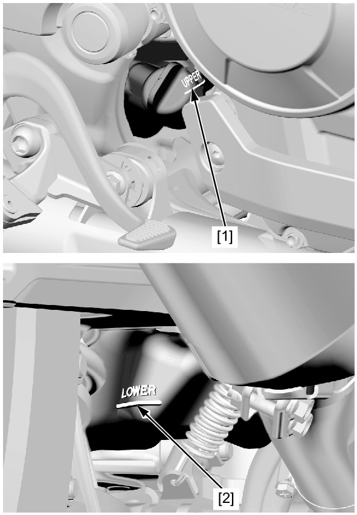
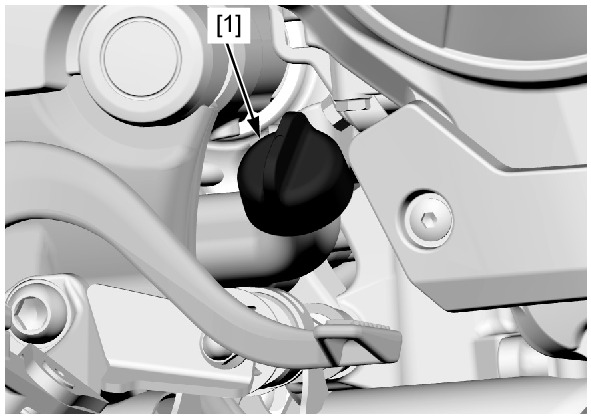

# Coolant-Level

Источник: `Coolant-Level.pdf`

RADIATOR COOLANT 
Check the coolant level of the reserve tank with the engine running at normal operating temperature. 
The level should be between the "UPPER" [1] and "LOWER" [2] level lines. 
If necessary, add the recommended coolant. 
RECOMMENDED ANTIFREEZE: 
Except TH: 
High quality ethylene glycol antifreeze containing silicate-free corrosion inhibitors 
TH: 
Honda PRE-MIX coolant 
RECOMMENDED MIXTURE (Except TH): 
1:1 mixture with distilled water 

Remove the reserve tank cap [1] and add the coolant to the "UPPER" level line. 
Reinstall the cap. 
Check to see if there are any coolant leaks when the coolant level decreases very rapidly. 
If the reserve tank becomes completely empty, there is a possibility of air getting into the cooling system. 
Be sure to remove any air from the cooling system . 

