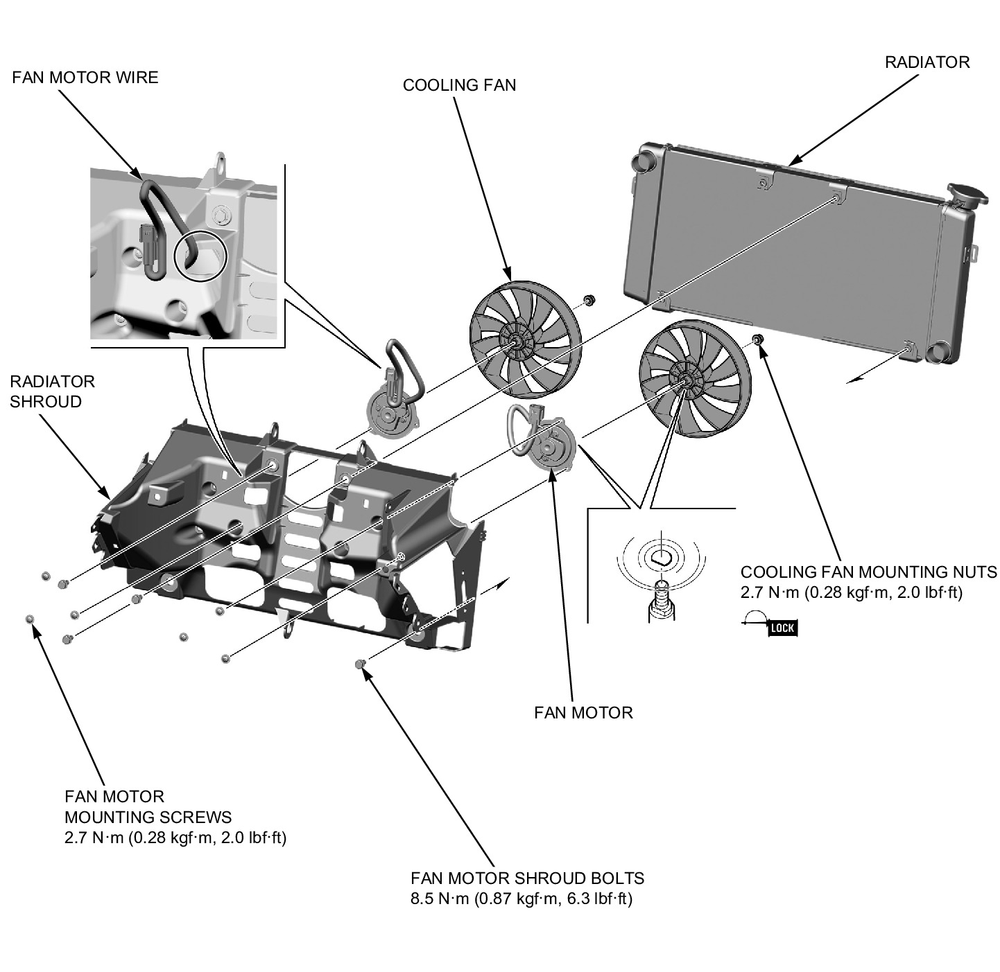
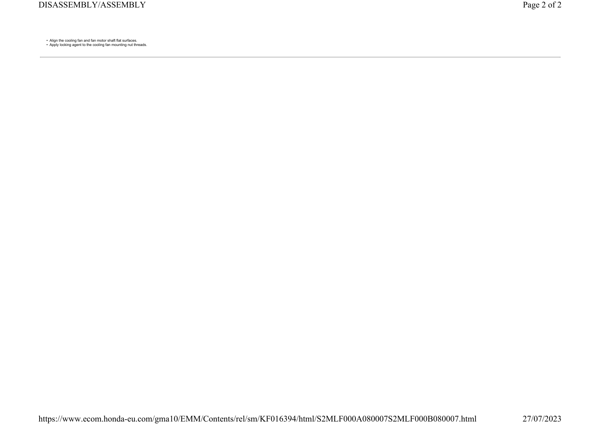

# Coolant-Radiator Assembly

Источник: `Coolant-Radiator Assembly.pdf`

DISASSEMBLY/ASSEMBLY 

NOTE: 

* Align the cooling fan and fan motor shaft flat surfaces. 
* Apply locking agent to the cooling fan mounting nut threads. 

