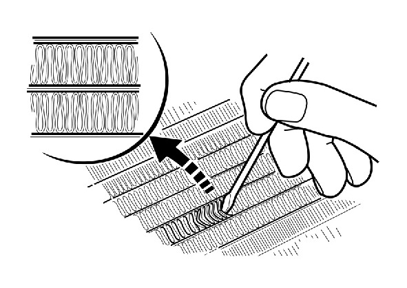

# Coolant-Radiator Inspect

Источник: `Coolant-Radiator Inspect.pdf`

COOLING SYSTEM 
Check the radiator air passages for clogging or 
damage. 
Straighten bent fins, and remove insects, mud or 
other obstructions with compressed air or low 
water pressure. 
Replace the radiator if the air flow is restricted over 
more than 20% of the radiating surface. 
Inspect the water hoses for cracks or deterioration, 
and replace them if necessary. 
Check the tightness of all water hose band 
screws . 

