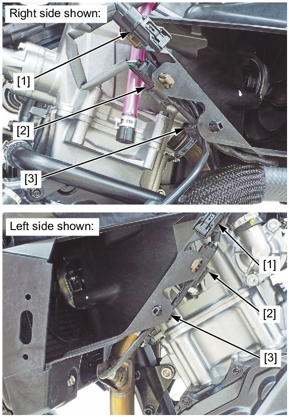
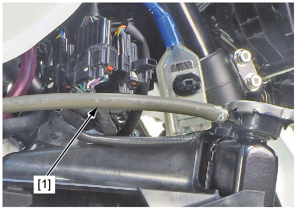
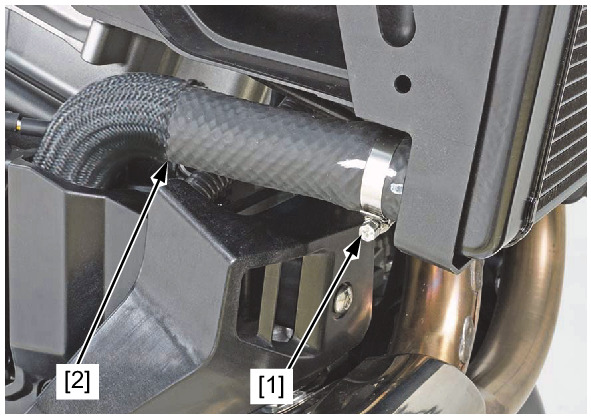
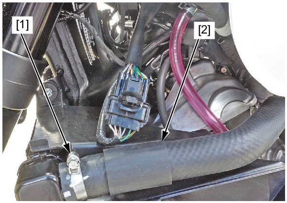
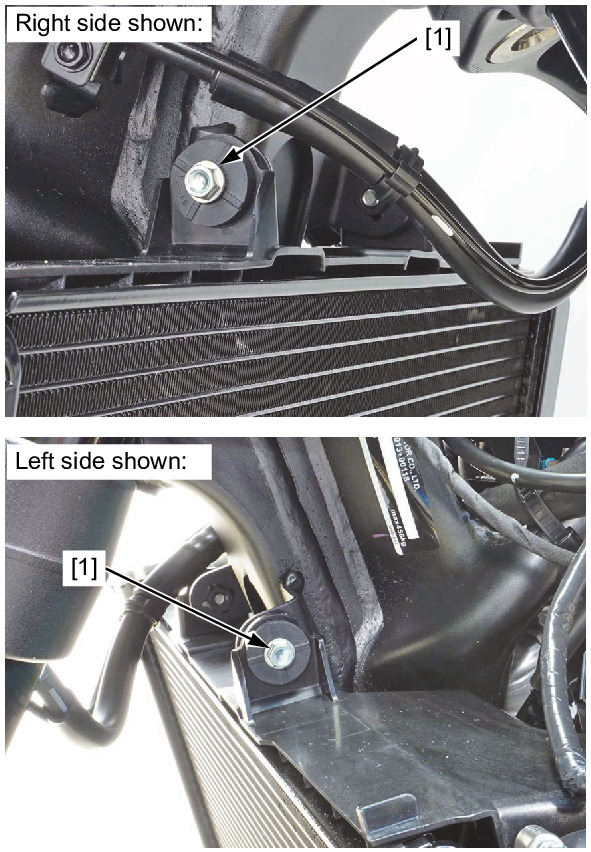
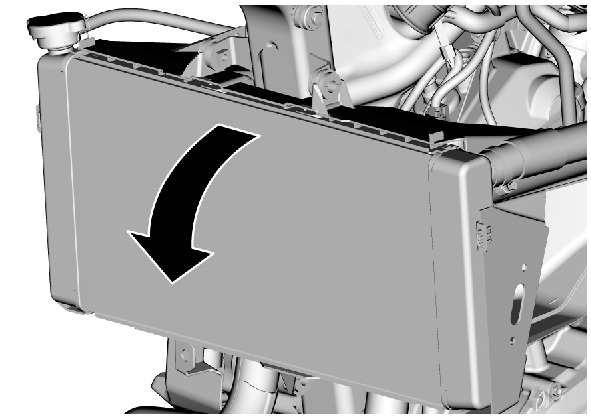
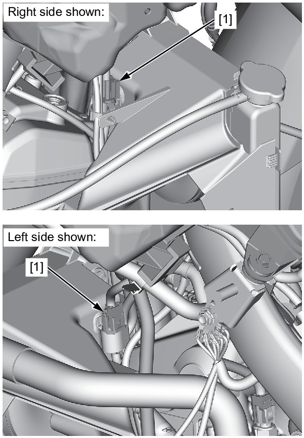
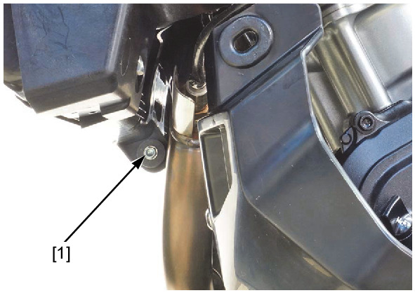
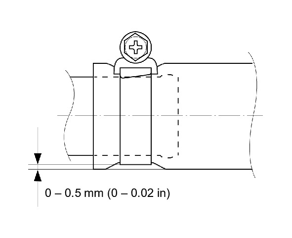

# Coolant-Radiator Remove&Install

Источник: `Coolant-Radiator Remove&Install.pdf`

REMOVAL/INSTALLATION 
Drain the coolant . 
Remove the Inner covers . 
Release the following from the radiator shroud: 
* Fog light 2P (Black) connectors [1] 
* A/F sensor 4P (Black) connectors [2] 
* Wire clips [3] 

Disconnect the siphon hose [1]. 
Loosen the hose band screw [1]. 
Disconnect the lower radiator hose [2]. 

Loosen the hose band screw [1]. 
Disconnect the upper radiator hose [2]. 
Remove the bolts [1]. 

Flip the radiator forward. 

Disconnect the fan motor 2P (Black) connectors [1]. 
Remove the following: 

* Bolt [1] 
* Radiator 
Installation is in the reverse order of removal. 

NOTE: 
* Tighten the water hose band screws to the specified range as shown. 
* Route the hoses and wires properly . 
Fill the recommended coolant mixture to the filler neck and bleed the air . 

