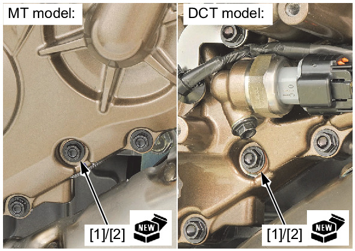
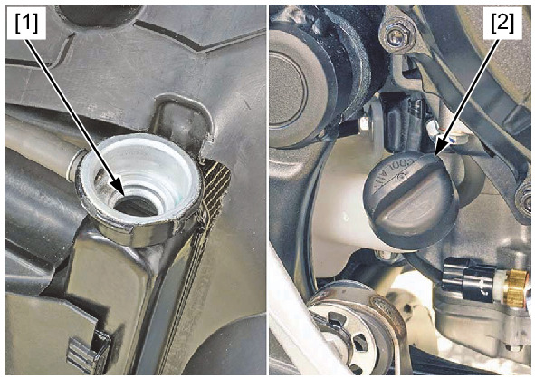

# Coolant-Replace&Bleeding

Источник: `Coolant-Replace&Bleeding.pdf`

REPLACEMENT/AIR BLEEDING 

NOTE: 
* When filling the system or reserve tank with coolant or checking the coolant level, place the motorcycle in an upright position on a 
flat, level surface. 
Remove the following: 
* Clutch EOP sensor cover (DCT model) 
* Deflector cover 
* Radiator cap 

Remove the coolant drain bolt [1], sealing washer 
[2], and drain the coolant. 

Reinstall the coolant drain bolt with a new sealing 
washer. 

Tighten the coolant drain bolt to the specified 
torque. 

TORQUE: 13 N·m (1.3 kgf·m, 10 lbf·ft) 

Remove the radiator reserve tank . 

Empty the coolant and rinse the inside of the 
reserve tank with water. 

Install the radiator reserve tank . 

Fill the system with the recommended coolant 
through the filler opening up to filler neck [1]. 

Remove the radiator reserve tank cap [2] and fill 
the reserve tank to the upper level line. 

Bleed air from the system as follows: 
1. Shift the transmission into neutral. 
Start the engine and let it idle for 2 – 
3 minutes. 
2. Snap the throttle 3 or 4 times to bleed 
air from the system. 
3. Stop the engine and add coolant up 
to the filler neck if necessary. 
4. Install the radiator cap. 
5. Check the level of coolant in the 
reserve tank and fill to the upper level 
line if it is low. 

NOTE: 
* When air bleeding is 
insufficient, level of coolant in 
the reserve tank will decrease. 
If so, fill to the upper level line 
with coolant. 
Check that there are no coolant leaks. 
Install the following: 
* Radiator cap 
* Deflector cover 
* Clutch EOP sensor cover (DCT model)
