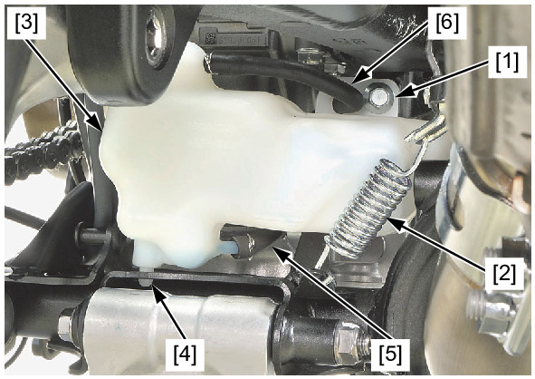

# Coolant-Reserve Tank

Источник: `Coolant-Reserve Tank.pdf`

REMOVAL/INSTALLATION 
Remove the following: 
* Shock absorber 
* Radiator reserve tank mounting bolt [1] 
* Spring [2] 
Remove the radiator reserve tank [3] by releasing 
the boss [4] from the frame. 
Disconnect the siphon hose [5] and drain the 
coolant. 
Installation is in the reverse order of removal. 

NOTE: 
* Route the radiator reserve tank drain hose [6] 
properly . 

