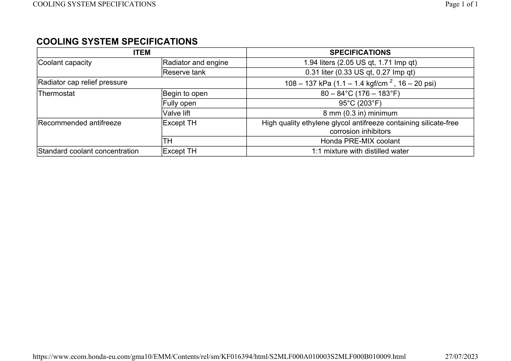

# Coolant-Specification

Источник: `Coolant-Specification.pdf`

COOLING SYSTEM SPECIFICATIONS 
ITEM 
SPECIFICATIONS 
Coolant capacity 
Radiator and engine 
1.94 liters (2.05 US qt, 1.71 Imp qt) 
Reserve tank 
0.31 liter (0.33 US qt, 0.27 Imp qt) 
Radiator cap relief pressure 
108 – 137 kPa (1.1 – 1.4 kgf/cm 2 , 16 – 20 psi) 
Thermostat 
Begin to open 
80 – 84°C (176 – 183°F) 
Fully open 
95°C (203°F) 
Valve lift 
8 mm (0.3 in) minimum 
Recommended antifreeze 
Except TH 
High quality ethylene glycol antifreeze containing silicate-free 
corrosion inhibitors 
TH 
Honda PRE-MIX coolant 
Standard coolant concentration 
Except TH 
1:1 mixture with distilled water 

