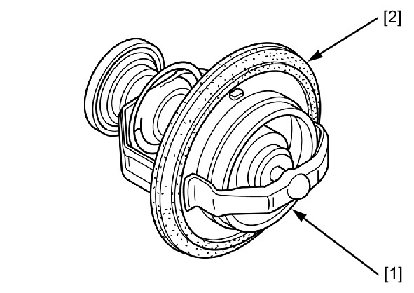
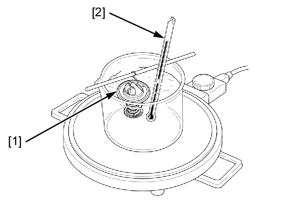

# Coolant-Thermostat Inspection

Источник: `Coolant-Thermostat Inspection.pdf`

INSPECTION 
Visually inspect the thermostat [1] for damage. 
Check the thermostat rubber [2] for damage and replace if necessary. 
Heat a container of water with an electric heating element for 5 minutes. 
Suspend the thermostat [1] in heated water to check its operation. 
THERMOSTAT BEGIN TO OPEN: 
80 – 84°C (176 – 183°F) 
VALVE LIFT: 
8 mm (0.3 in) minimum at 95°C (203°F) 

NOTE: 
* Do not let the thermostat or thermometer [2] touch the container, or you will get a false reading. 
Replace the thermostat if the valve opens at a temperature other than those specified. 

