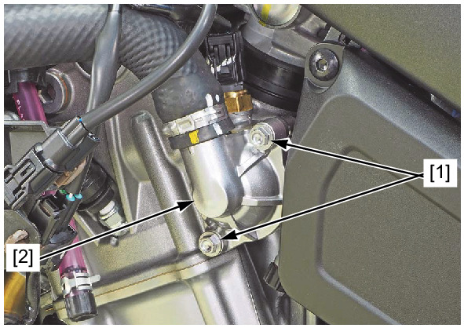
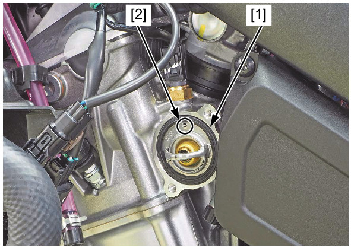

# Coolant-Thermostat Remove&Install

Источник: `Coolant-Thermostat Remove&Install.pdf`

REMOVAL/INSTALLATION 
Drain the coolant . 
Remove the left side cover . 
Remove the thermostat cover bolts [1] and open the thermostat cover [2]. 
Remove the thermostat [1] from the cylinder head. 
Installation is in the reverse order of removal. 
TORQUE: 
Thermostat cover bolt: 
12 N·m (1.2 kgf·m, 9 lbf·ft) 

NOTE: 
* Install the thermostat with the air bleed hole [2] facing up. 

