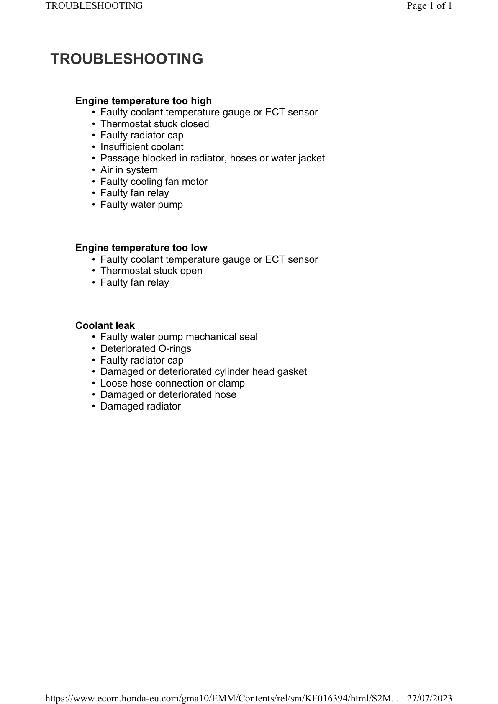

# Coolant-Troubleshooting

Источник: `Coolant-Troubleshooting.pdf`

TROUBLESHOOTING 
Engine temperature too high 
* Faulty coolant temperature gauge or ECT sensor 
* Thermostat stuck closed 
* Faulty radiator cap 
* Insufficient coolant 
* Passage blocked in radiator, hoses or water jacket 
* Air in system 
* Faulty cooling fan motor 
* Faulty fan relay 
* Faulty water pump 
Engine temperature too low 
* Faulty coolant temperature gauge or ECT sensor 
* Thermostat stuck open 
* Faulty fan relay 
Coolant leak 
* Faulty water pump mechanical seal 
* Deteriorated O-rings 
* Faulty radiator cap 
* Damaged or deteriorated cylinder head gasket 
* Loose hose connection or clamp 
* Damaged or deteriorated hose 
* Damaged radiator 

