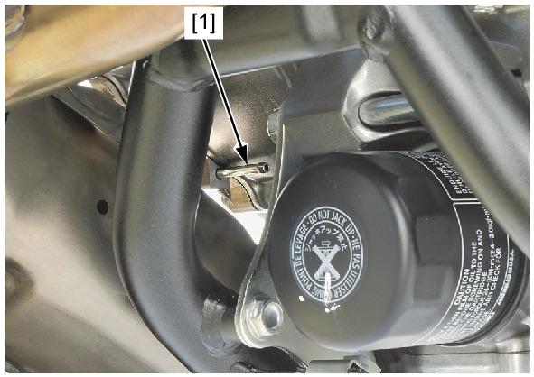

# Coolant-Water Pump Inspection

Источник: `Coolant-Water Pump Inspection.pdf`

MECHANICAL SEAL INSPECTION 
Remove the under cover . 
Check the water pump bleed pipe [1] for signs of 
coolant leakage. 

NOTE: 
* A small amount of coolant weeping from the 
bleed pipe is normal. 
* Make sure that there is no continuous coolant 
leakage from the bleed pipe while operating 
the engine. 
Replace the water pump as an assembly if 
necessary. 
Install the under cover . 

