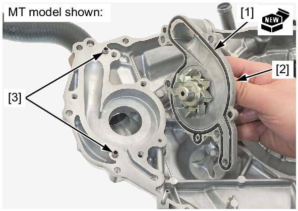
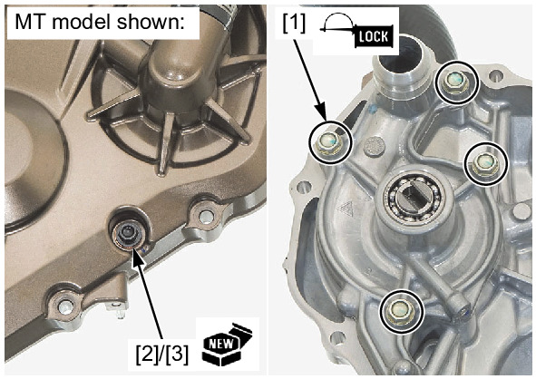

# Coolant-Water Pump Install

Источник: `Coolant-Water Pump Install.pdf`

INSTALLATION 
Install a new O-ring [1] into the 
groove in the water pump body 
[2]. 
Install the dowel pins [3] and 
water pump body. 

Apply locking agent to the water 
pump cover bolts threads . 
Install and tighten the water 
pump cover bolts [1] to the 
specified torque. 
TORQUE: 13 N·m (1.3 kgf·m, 
10 lbf·ft) 
Install the coolant drain bolt [2] 
and a new sealing washer [3]. 
Tighten the coolant drain bolt to 
the specified torque. 
TORQUE: 13 N·m (1.3 kgf·m, 
10 lbf·ft) 
Install the right crankcase cover: 
* MT model: 
* DCT model: 

