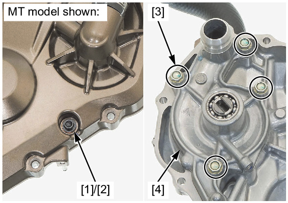

# Coolant-Water Pump Remove

Источник: `Coolant-Water Pump Remove.pdf`

REMOVAL 
Remove the right crankcase cover: 
* MT model: 
* DCT model: 
Remove the coolant drain bolt [1] and sealing 
washer [2]. 
Remove the water pump cover bolts [3] and water 
pump body [4]. 

