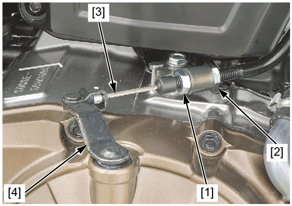
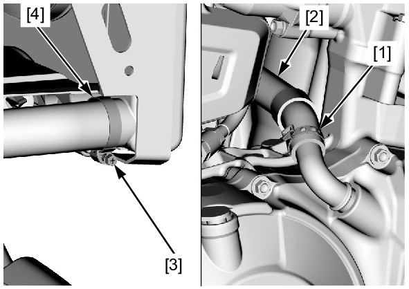
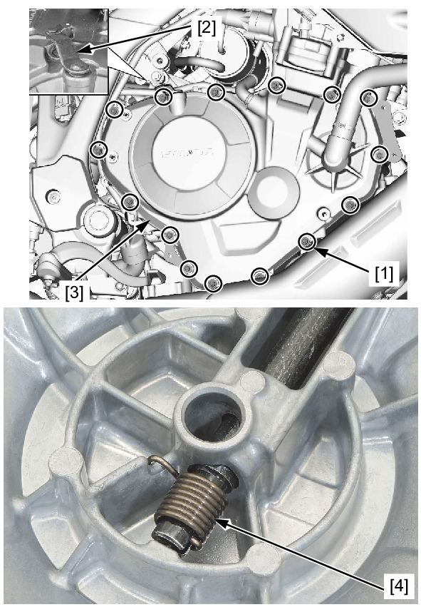
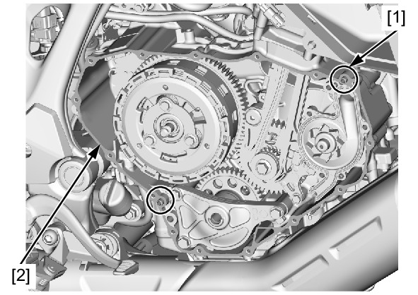
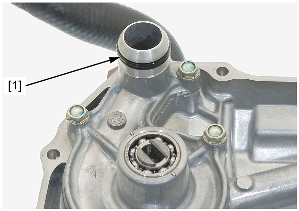

# Cover-Crankcase Right Remove

Источник: `Cover-Crankcase Right Remove.pdf`

REMOVAL 
Drain the engine oil . 
Drain the coolant . 
Remove the right rear engine cover . 
Loosen the lock nut [1] and lower adjusting nut [2]. 
Disconnect the clutch cable [3] from the clutch lifter lever [4]. 
Cut off and remove the hose clamp [1]. 
Disconnect the bypass hose [2]. 
Loosen the hose band screw [3]. 
Disconnect the radiator lower hose [4]. 

Remove the right crankcase cover bolts [1]. 
Turn the clutch lifter lever [2] counterclockwise to disengage the lifter lever slit from the clutch lifter pin. 
Remove the right crankcase cover [3]. 

NOTE: 
* Be careful not to drop the return spring. 
Remove the dowel pins [1] and gasket [2]. 

Remove the O-ring [1]. 

