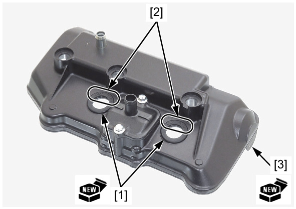
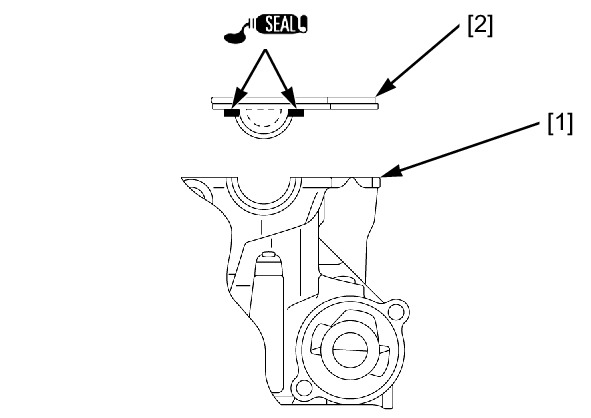
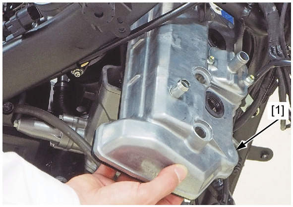
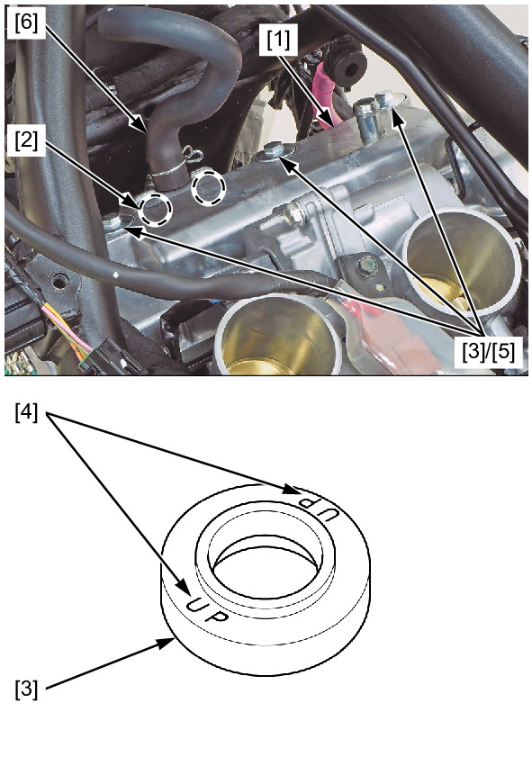
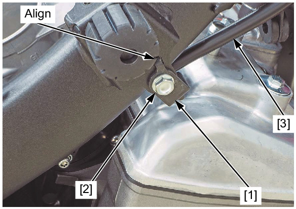

# Cover-Cylinder Head Install

Источник: `Cover-Cylinder Head Install.pdf`

INSTALLATION 
Install new plug pipe seals [1] to the cylinder head cover. 

NOTE: 
* Install the plug pipe seals with their "OUT SIDE" marks [2] facing up. 
Install a new cylinder head cover packing [3] to the cylinder head cover. 
Clean the cylinder head [1] mating surface thoroughly. 
Apply liquid sealant (TB5211C manufactured by ThreeBond, KE45T manufactured by Shin-Etsu Silicone or an 
equivalent) to the cylinder head cover packing [2] as shown. 

NOTE: 
* Do not apply more liquid sealant than necessary. 

Insert the cylinder head cover [1] from the right side as shown. 
Install the cylinder head cover [1] on the cylinder head. 

NOTE: 
* Be sure to be installed the dowel pins [2] of the cylinder head cover to the cylinder head holes securely. 
Check that the mounting rubbers [3] are in good condition, and replace them if necessary. 
Install the mounting rubbers. 

NOTE: 
* Install the mounting rubbers with their "UP" marks [4] facing up. 
Install and tighten the cylinder head cover bolts [5] to the specified torque. 
TORQUE: 10 N·m (1.0 kgf·m, 7 lbf·ft) 
Connect the secondary air supply hose [6]. 

Install the following: 
* Cable stay [1] 
* Bolt [2] 
* Ignition coil tray 

NOTE: 
* Align the cable stay tab with the frame hole. 
Tighten the bolt securely. 
Hook the following cable [3] to the cable stay: 
* Clutch cable (MT model) 
* Parking brake cable (DCT model) 

