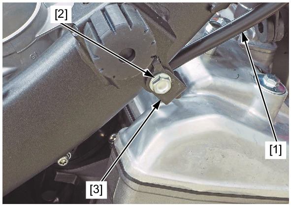
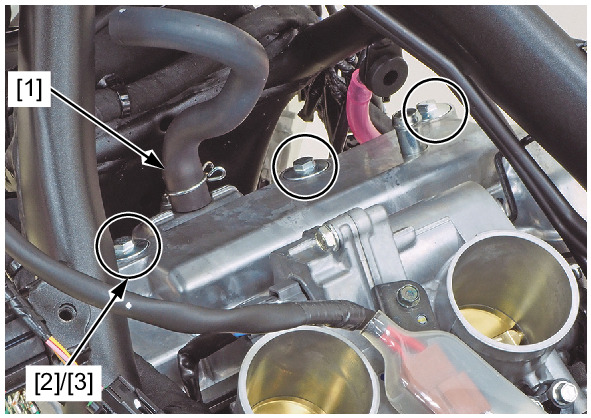
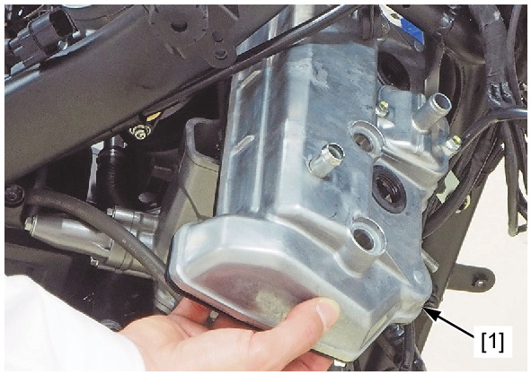
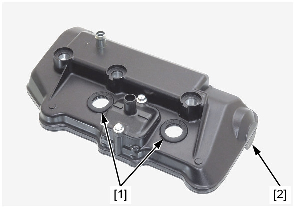

# Cover-Cylinder Head Removal

Источник: `Cover-Cylinder Head Removal.pdf`

REMOVAL 
Remove the ignition coil tray . 
Release the following cable [1] to the clutch cable stay [2]. 
* Clutch cable (MT model) 
* Parking brake cable (DCT model) 
Remove the bolt [3] and cable stay. 
Disconnect the secondary air supply hose [1]. 
Remove the cylinder head cover bolts [2] and mounting rubbers [3]. 

Remove the cylinder head cover [1] to the right side as shown. 
Remove the plug pipe seals [1] and cylinder head cover packing [2] from the cylinder head cover. 

