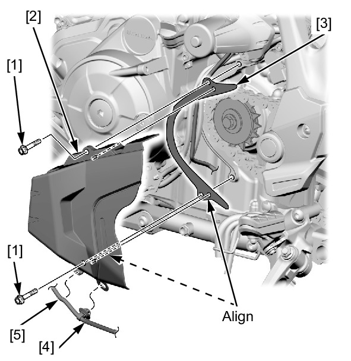

# Cover-Front Sprocket

Источник: `Cover-Front Sprocket.pdf`

REMOVAL/INSTALLATION 
Remove the gearshift arm . 
! MT model only: 
Remove the left rear cover bolts [1], left rear cover [2] and drive chain guide plate [3]. 
Release the sidestand wire clip [4] and sidestand wire [5] from the left rear cover. 
Installation is in the reverse order of removal. 
TORQUE: 
Left rear cover bolt: 
12 N·m (1.2 kgf·m, 9 lbf·ft) 

NOTE: 
* Align the chain guide plate holes with the left rear cover bosses. 
* Route the wires properly . 

