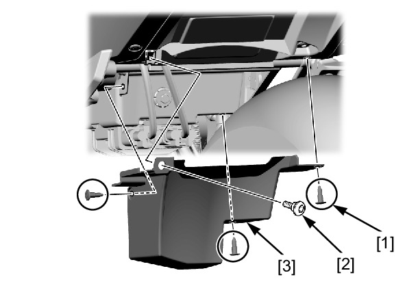

# Cover-Regulator_Rectifier

Источник: `Cover-Regulator_Rectifier.pdf`

REMOVAL/INSTALLATION 
Remove the following: 
* Trim clips [1] 
* Socket bolt [2] 
* Regulator/rectifier cover [3] 
Installation is in the reverse order of removal. 

