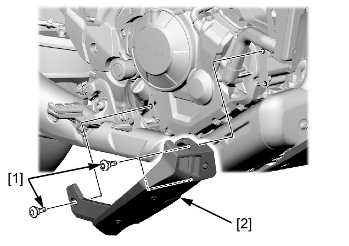

# Cover-Right Deflector (NT)

Источник: `Cover-Right Deflector (NT).pdf`

REMOVAL/INSTALLATION 
Remove the following: 
* Socket bolts [1] 
* Deflector cover [2] 
Installation is in the reverse order of removal. 

