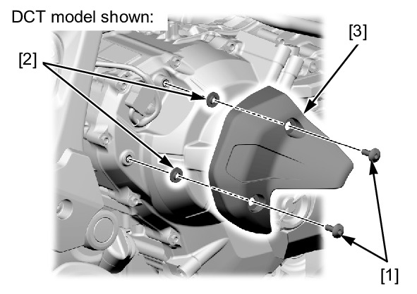

# Cover-Right Engine Heat

Источник: `Cover-Right Engine Heat.pdf`

REMOVAL/INSTALLATION 
Remove the right rear engine cover bolts [1], 
collars [2] and right rear engine cover [3]. 
Installation is in the reverse order of removal. 
TORQUE: 
Right rear engine cover socket bolt: 
10 N·m (1.0 kgf·m, 7 lbf·ft) 

