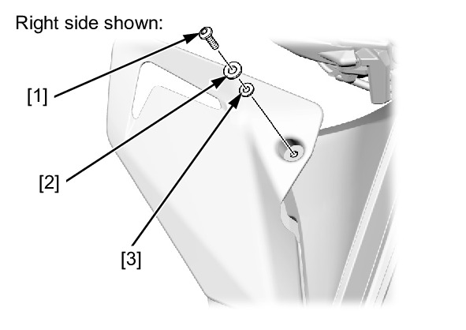
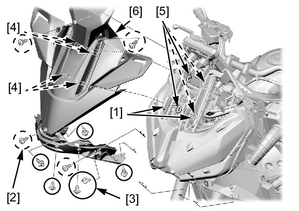

# Cowl - Front

Источник: `Cowl - Front.pdf`

REMOVAL/INSTALLATION 
Remove the following: 
* Windscreen stay 
* Middle cowl 
* Upper deflector 
socket bolt (long) 
[1] 
* Plastic washer [2] 
* Rubber washer 
[3] 

Move the screen 
sliders [1] to the bottom 
position. 
Remove the following: 
* Socket bolts [2] 
* Trim clips [3] 
Release the bosses [4] 
from the grommets [5]. 
Remove the front cowl 
[6]. 
Installation is in the 
reverse order of 
removal. 
TORQUE: 
Upper deflector 
socket bolt (long): 
0.54 N·m (0.06 
kgf·m, 0.4 lbf·ft) 

