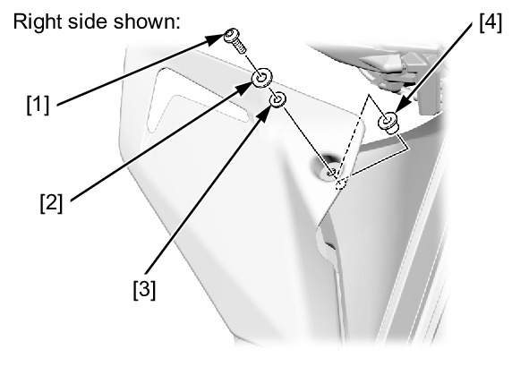
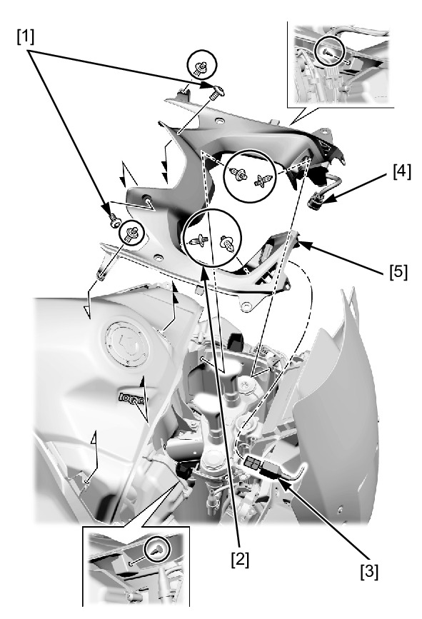
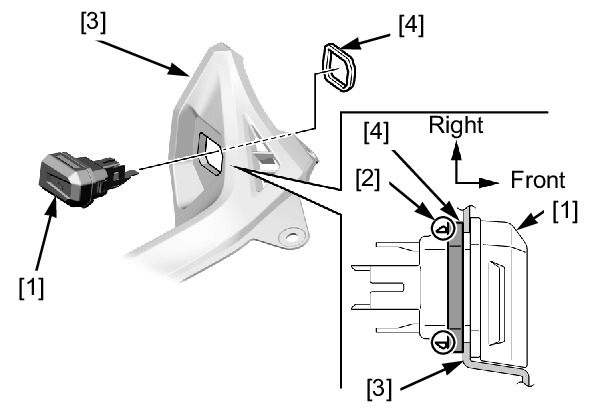

# Cowl - Fuel Tank

Источник: `Cowl - Fuel Tank.pdf`

REMOVAL/INSTALLATION 
Remove the following: 
* Middle cowl 
* Upper deflector socket bolt (long) [1] 
* Plastic washer [2] 
* Rubber washer [3] 
* Well nuts [4] 
Remove the following: 
* Socket bolts [1] 
* Trim clips [2] 
Disconnect the USB socket [3] and accessory socket 2P (Black) connector [4]. 
Remove the tank front cover [5]. 

Remove the USB socket box [1] by releasing its tabs [2] from the tank front cover [3]. 
Remove the collar [4]. 
Installation is in the reverse order of removal. 
TORQUE: 
Upper deflector socket bolt (long): 
0.54 N·m (0.06 kgf·m, 0.4 lbf·ft) 

NOTE: 
* Install the USB socket box as shown. 

