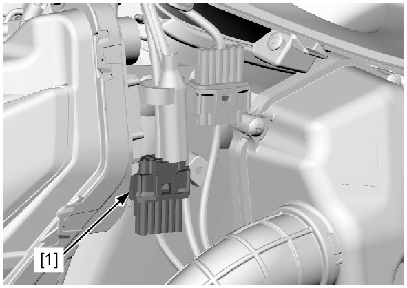
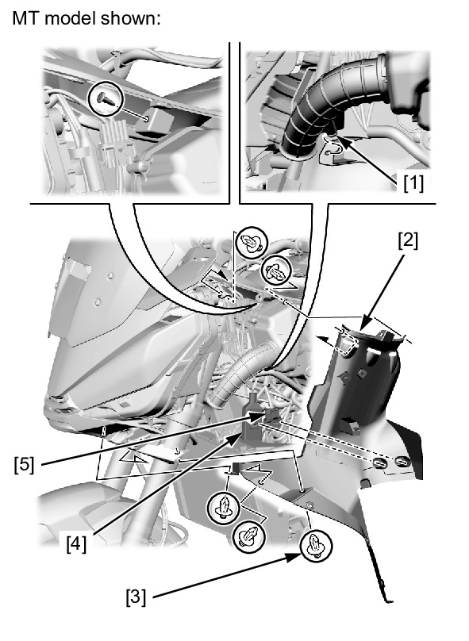
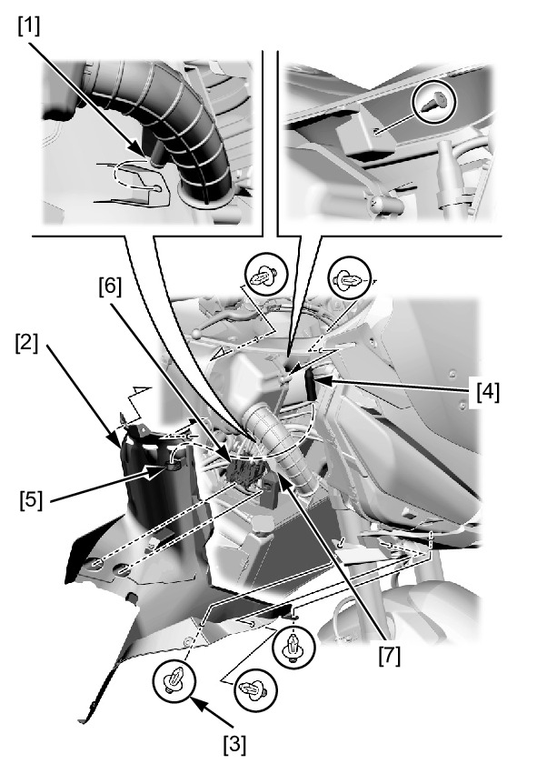

# Cowl - Inner L&R

Источник: `Cowl - Inner L&R.pdf`

REMOVAL/INSTALLATION 
LEFT SIDE 
Remove the left side cover . 
Release the sub harness 12P (Black) clip connector [1] from the left inner cover. 
Release the tab [1] of the air cleaner duct from the left inner cover [2]. 
Remove the trim clips [3]. 
Releases the following from the left inner cover. 
* Left handlebar switch 12P (Black) connector clip [4] 
* Left handlebar switch 8P (Gray) connector clip [5] 
! MT model: 
Remove the left inner cover. 
Installation is in the reverse order of removal. 

RIGHT SIDE 
Remove the right side cover . 
Release the tab [1] of the air cleaner duct from the right inner cover [2]. 
Remove the trim clips [3]. 
Release the front right turn signal light 2P (Light blue) connector [4] from the clamp [5]. 
Release the following from the right inner cover: 
* Connector holder clip [6] 
* Right handlebar switch 8P (Gray) connector clip [7] 
Remove the right inner cover. 
Installation is in the reverse order of removal. 

