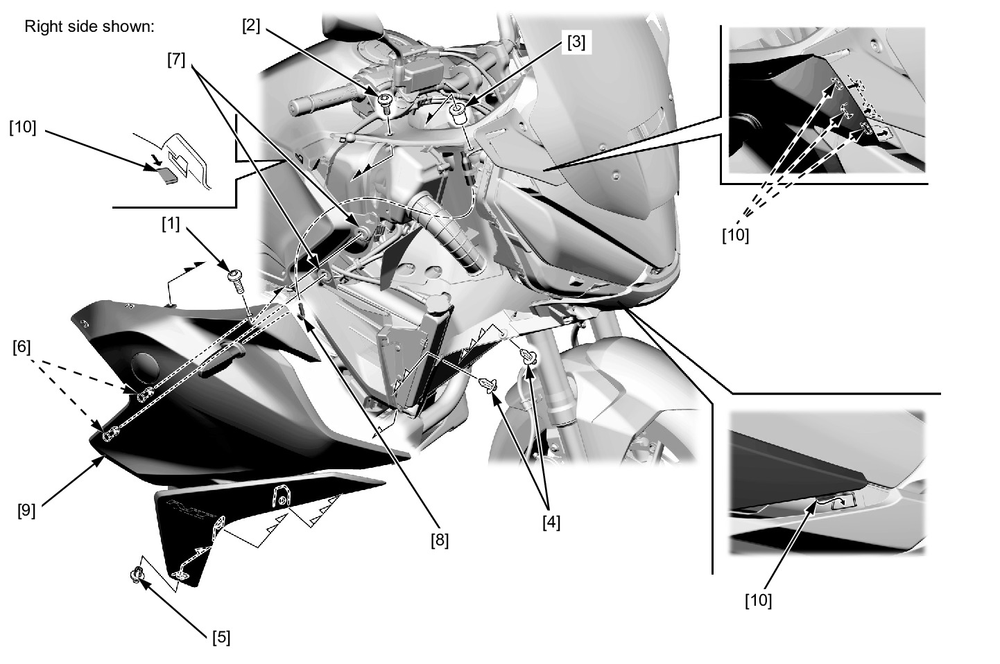

# Cowl - Middle

Источник: `Cowl - Middle.pdf`

REMOVAL/INSTALLATION 
Remove the following: 
* Middle cowl socket bolt A [1] 
* Middle cowl socket bolt B [2] 
* Well nut [3] 
* Trim clips A [4] 
* Trim clip B [5] 
Release the bosses [6] from the grommets [7]. 
Disconnect the front turn signal light 2P (Light blue) connector [8]. 
Remove the middle cowl [9] by releasing the tabs [10] from the side cover and front lower cowl. 
Installation is in the reverse order of removal. 
TORQUE: 
Middle cowl socket bolt A: 
0.54 N·m (0.06 kgf·m, 0.4 lbf·ft) 

