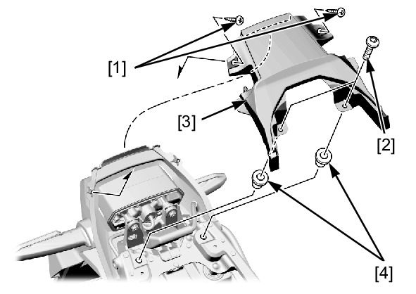

# Cowl - Rear Centre

Источник: `Cowl - Rear Centre.pdf`

REMOVAL/INSTALLATION 
Remove the rear carrier . 
Remove the following: 
* Tapping screws [1] 
* Rear center cowl socket bolts [2] 
* Rear center cowl [3] 
* Well nuts [4] 
Installation is in the reverse order of removal. 
TORQUE: 
Rear center cowl socket bolt: 
0.42 N·m (0.04 kgf·m, 0.3 lbf·ft) 

