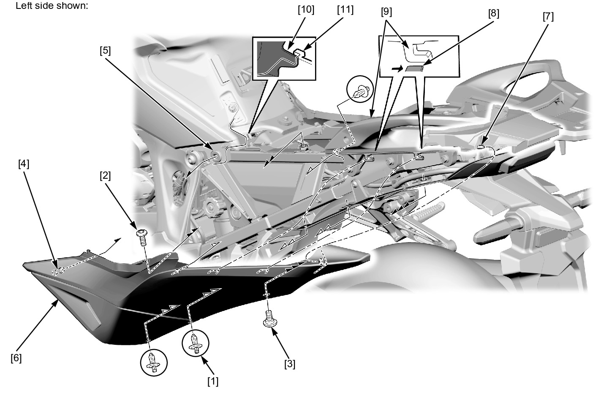
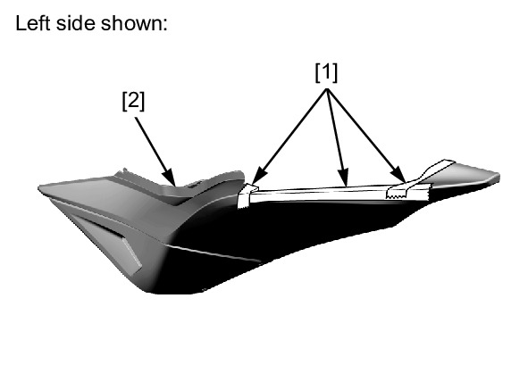

# Cowl - Rear Side

Источник: `Cowl - Rear Side.pdf`

REMOVAL/INSTALLATION 
Remove the 
main seat . 
Remove the 
trim clips [1], 
socket bolt A 
[2] and socket 
bolts B [3]. 
Remove the 
bosses [4] 
from the 
grommets [5]. 
Release the 
rear side cowl 
[6] from the 
rear center 
cowl boss [7]. 
Remove the 
rear side cowl 
by releasing its 
tabs [8] with 
sliding 
backward from 
the rear carrier 
[9]. 
Installation is 
in the reverse 
order of 
removal. 

NOTE: 
* Align the 
side 
cover tab 
[10] with 
the rear 
side cowl 
slot [11] 
correctly 
when 
installing. 

NOTE: 
* Apply the masking tape [1] around the top of the rear side cowl [2] to prevent any damage when removal/installation. 

