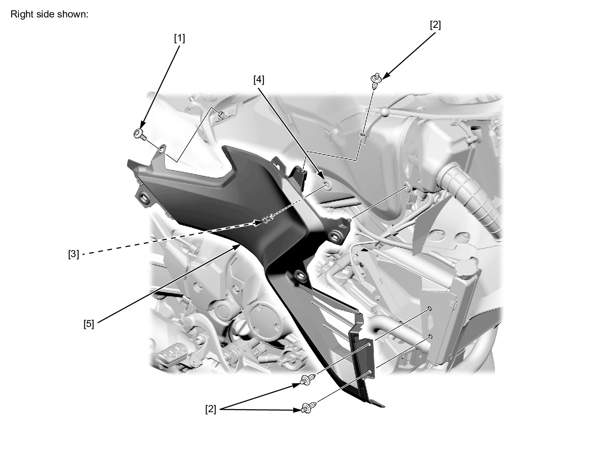
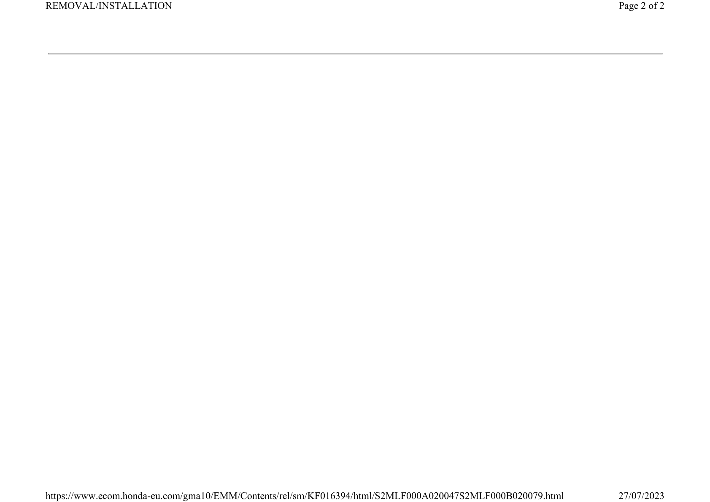

# Cowl - Side L&R

Источник: `Cowl - Side L&R.pdf`

REMOVAL/INSTALLATION 
Remove the following: 
* Middle cowl 
* Rear side cowl 
* Socket bolt [1] 
* Trim clips [2] 
Release the bosses [3] from the grommets [4]. 
Remove the side cover [5]. 
Installation is in the reverse order of removal. 

