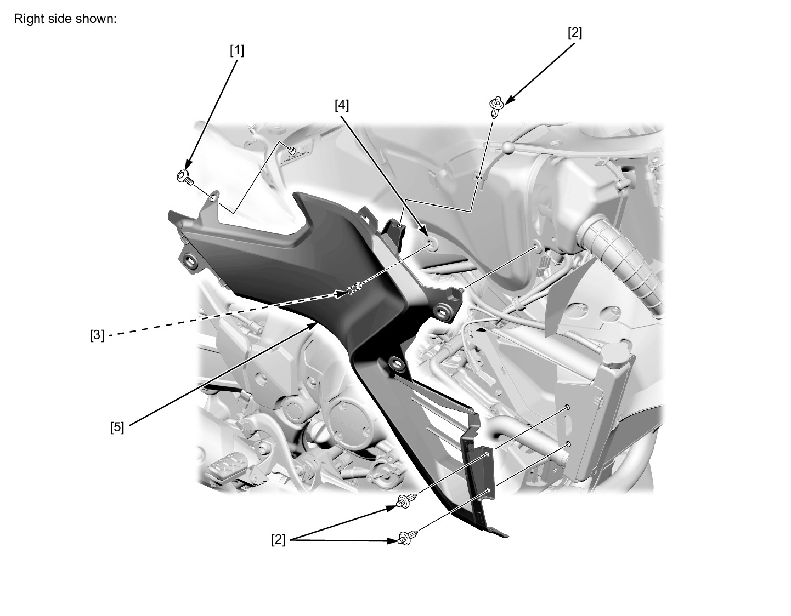

# Cowl - Side L&R REMOVAL/INSTALLATION

Remove the following: 
* [Middle cowl](../Cowl%20-%20Middle/Cowl%20-%20Middle.md)
* [Rear side cowl](../Cowl%20-%20Rear%20Side/Cowl%20-%20Rear%20Side.md)
* Socket bolt [1] 
* Trim clips [2] 

Release the bosses [3] from the grommets [4]. 

Remove the side cover [5]. 

Installation is in the reverse order of removal. 

