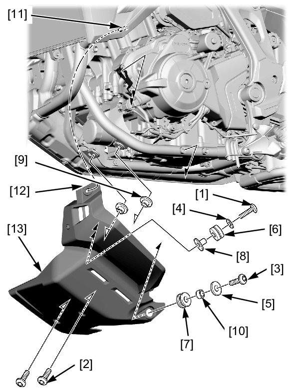

# Cowl - Under Cover

Источник: `Cowl - Under Cover.pdf`

REMOVAL/INSTALLATION 
Remove the following: 
* Socket bolt A [1] 
* Socket bolts B [2] 
* Socket bolt C [3] 
* Washer A [4] 
* Washers B [5] 
* Grommet A [6] 
* Grommet B [7] 
* Collar A [8] 
* Collars B [9] 
* Collar C [10] 
Release the boss [11] from the grommet [12]. 
Remove the under cover [13]. 
Installation is in the reverse order of removal. 

