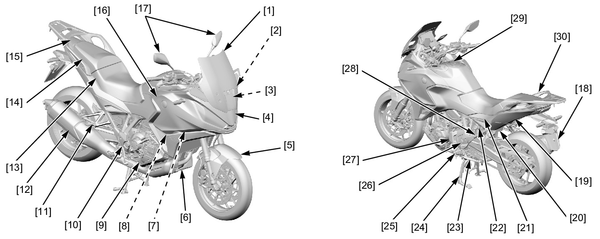

# Cowl&Cover - Locations

Источник: `Cowl&Cover - Locations.pdf`

BODY PANEL LOCATIONS 
[1] Windscreen 
[10] Right rear engine cover 
[21] Rear side cowl 
[2] Windscreen stay 
[11] Pillion step 
[22] Seat catch hook/seat lock cylinder 
[3] Windscreen adjust rail 
[12] Muffler/exhaust pipe 
[4] Front cowl 
[13] Main seat 
[23] Sidestand 
[5] Front fender 
[14] Pillion seat 
[24] Mainstand 
[6] Under cover 
[15] Rear center cowl 
[25] Main step 
[7] Inner cover 
[16] Middle cowl 
[26] Heel guard 
[8] Side cover 
[17] Rearview mirror 
[27] Left rear cover 
[9] Clutch EOP sensor cover (DCT model) 
Deflector cover (MT model) 
[18] Rear fender A 
[28] Seat rail 
[19] Rear fender B 
[29] Tank front cover 
[20] Regulator/rectifier cover 
[30] Rear carrier 
1.
BODY PANEL REMOVAL CHART 

